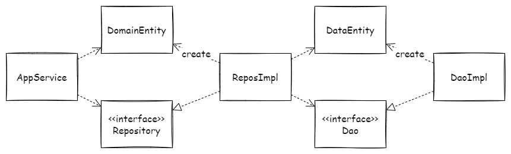

リポジトリとDAOは似ていますが、どこか違いがありそうです。リポジトリとDAOはどちらもアプリケーションコードとデータストアの間に位置します。リポジトリとDAOの違いはどこにあるのか、参考文献からそれぞれの目的を調べてみます。また具体的にリポジトリとDAOをどう使い分けられそうかを考えてみます。

# リポジトリはドメインオブジェクトのコレクション

> A Repository mediates between the domain and data mapping layers, acting like an in-memory domain object collection.   
-- [P of EAA: Repository](https://martinfowler.com/eaaCatalog/repository.html)

リポジトリはエンタープライズアプリケーションアーキテクチャパターンにおいて次のように説明されています。リポジトリはドメインとデータマッピングレイヤをとりなして、インメモリな**ドメインオブジェクトのコレクション**のように振る舞います。

> Conceptually, a Repository encapsulates the set of objects persisted in a data store and the operations performed over them, [...]  
-- [P of EAA: Repository](https://martinfowler.com/eaaCatalog/repository.html)

リポジトリはドメインオブジェクトの永続化に関わる操作を隠蔽しているとも言えます。

> [...]それ自体はドメインに由来しないが、ドメイン設計においては意味のある役割を持っている。これらの構成概念は、モデルオブジェクトを操作できるようにすることで、[...]  
-- エリック・エヴァンスのドメイン駆動設計

また、エリック・エヴァンスのドメイン駆動設計において次のように説明されています。リポジトリの目的はドメインオブジェクトを操作できるようにすることです。リポジトリそのものはモデルとは呼ばないようです。

# DAOはデータアクセスのメカニズムを隠蔽する

> separates a data resource&#39;s client interface from its data access mechanisms  
-- [Design Patterns: Data Access Object](https://www.oracle.com/java/technologies/data-access-object.html)

DAOはデザインパターンのひとつです。DAOはデータリソースのクライアントインタフェースをデータアクセスのメカニズムから分離します。**データアクセスのメカニズム**を隠蔽する点はリポジトリと同じです。

> The DAO pattern allows data access mechanisms to change independently of the code that uses the data.  
-- [Design Patterns: Data Access Object](https://www.oracle.com/java/technologies/data-access-object.html)

DAOの目的はデータを利用するコードから独立してデータアクスのメカニズムを変更できるようにすることです。

# リポジトリとDAOは関心の向きに違いがある

リポジトリとDAOにはそれぞれ目的があります。リポジトリの目的はアプリケーションコードがドメインオブジェクトを操作できるようにすることです。一方で、DAOの目的はアプリケーションコードから独立してデータアクセスのメカニズムを変更できるようにすることです。

つまり、リポジトリとDAOはデータストアとアプリケーションコードの間に位置する点で一致しますが、関心の向きに違いがあると言えそうです。リポジトリの関心はドメインオブジェクトにあり、DAOの関心はデータアクセスのメカニズムにあります。

# リポジトリとDAOを使い分ける

ここで、リポジトリとDAOをどう使い分けられるかを考えてみます。

まず、リポジトリの実装としてドメインオブジェクトを構築するサービスを設けます。リポジトリは「ドメインオブジェクトのコレクション」としての振る舞いをもちます。ドメインオブジェクトはデータベースのエンティティから組み立てます。ここで、ドメインオブジェクトの構成はデータベースのエンティティの構成と同じとは限りませんので、データベースのエンティティからドメインオブジェクトを構築するマッピングのメカニズムがあります。リポジトリがその役割を担います。

次に、DAOの実装としてJPAやMyBatisなどのライブラリがあります。DAOはデータアクセスのメカニズムを隠蔽するものです。JPAやMyBatisを利用すれば、インタフェースを用意するだけでデータベースのエンティティを取得・操作できます。JPAやMyBatisがその実装を引き受けて、これを隠蔽してくれていると考えることができます。

上記を図に整理してみます。

なお、JPAではドメインオブジェクトの構成とデータベースのエンティティの構成を柔軟にマッピングできます。JPAを適切に利用できれば、リポジトリの役割りとDAOの役割りを兼ねて実装することができます。

# まとめ

リポジトリとDAOの違いは目的の違いです。

リポジトリの目的はアプリケーションコードがドメインオブジェクトを操作できるようにすることです。リポジトリはデータベースのエンティティからドメインオブジェクトを構築することで、ドメインオブジェクトのコレクションのように振る舞います。

DAOの目的はアプリケーションコードから独立してデータアクセスのメカニズムを変更できるようにすることです。DAOはクライアントインタフェースを設けることで、データアクセスのメカニズムを隠蔽します。

リポジトリとDAOの使い分け方は隠蔽するメカニズムとアプリケーションコードに対する役割で整理できます。

リポジトリとDAOにはそれぞれ隠蔽するメカニズムがあります。リポジトリはドメインオブジェクト構築のメカニズムを隠蔽して、ドメインオブジェクトのコレクションとしての操作をクライアントに提供します。DAOはデータアクセスのメカニズムを隠蔽して、データベースのエンティティを読み書きする操作をクライアントに提供します。

リポジトリとDAOは併せて、アプリケーションコードに対して次の役割と目的をもちます。ドメインオブジェクトの永続化に関わる物理的な操作を隠蔽し、アプリケーションコードがドメインオブジェクトを概念的に操作できるようにします。アプリケーションコードがリポジトリを利用し、リポジトリがDAOを利用することでこれを実現します。

----

# 参考

- [P of EAA: Repository](https://martinfowler.com/eaaCatalog/repository.html)
- [Design Patterns: Data Access Object](http://www.oracle.com/technetwork/java/dao-138818.html)
- [c# - What is the difference between the Data Mapper, Table Data Gateway (Gateway), Data Access Object (DAO) and Repository patterns? - Stack Overflow](https://stackoverflow.com/questions/804751/what-is-the-difference-between-the-data-mapper-table-data-gateway-gateway-da)

# アソシエイトリンク

- [エリック・エヴァンスのドメイン駆動設計: ソフトウェアの核心にある複雑さに立ち向かう 単行本](https://www.amazon.co.jp/%E3%82%A8%E3%83%AA%E3%83%83%E3%82%AF%E3%83%BB%E3%82%A8%E3%83%B4%E3%82%A1%E3%83%B3%E3%82%B9%E3%81%AE%E3%83%89%E3%83%A1%E3%82%A4%E3%83%B3%E9%A7%86%E5%8B%95%E8%A8%AD%E8%A8%88-Architects%E2%80%99Archive-%E3%82%BD%E3%83%95%E3%83%88%E3%82%A6%E3%82%A7%E3%82%A2%E9%96%8B%E7%99%BA%E3%81%AE%E5%AE%9F%E8%B7%B5-%E3%82%A8%E3%83%AA%E3%83%83%E3%82%AF%E3%83%BB%E3%82%A8%E3%83%B4%E3%82%A1%E3%83%B3%E3%82%B9/dp/4798121967?_encoding=UTF8&dib_tag=se&dib=eyJ2IjoiMSJ9.QVYIYI5g6MsJJmFhmLMzbg.5fQyzKM663QV7UU-pRqz6d34w0t3xNjfhcDkbvnZ8Nc&qid=1705678642&sr=8-1&linkCode=ll1&tag=fukuchiharuki-22&linkId=88d6499e2585d963267e63dec60d1eee&language=ja_JP&ref_=as_li_ss_tl)
- [実践ドメイン駆動設計 単行本（ソフトカバー）](https://www.amazon.co.jp/%E5%AE%9F%E8%B7%B5%E3%83%89%E3%83%A1%E3%82%A4%E3%83%B3%E9%A7%86%E5%8B%95%E8%A8%AD%E8%A8%88-Object-Oriented-SELECTION-%E3%83%B4%E3%82%A1%E3%83%BC%E3%83%B3%E3%83%BB%E3%83%B4%E3%82%A1%E3%83%BC%E3%83%8E%E3%83%B3/dp/479813161X?__mk_ja_JP=%E3%82%AB%E3%82%BF%E3%82%AB%E3%83%8A&crid=37FZ9H5359DVX&dib=eyJ2IjoiMSJ9.1_8ajliR_YewOi4HCxjArQ.NMINaX63pA09xceFqg-qkaPCYOpAWpN30-ouTdXVO4w&dib_tag=se&keywords=479813161X&qid=1705678726&sprefix=%E3%82%A8%E3%83%AA%E3%83%83%E3%82%AF+%E3%82%A8%E3%83%B4%E3%82%A1%E3%83%B3%E3%82%B9%E3%81%AE%E3%83%89%E3%83%A1%E3%82%A4%E3%83%B3%E9%A7%86%E5%8B%95%E8%A8%AD%E8%A8%88+%E3%82%BD%E3%83%95%E3%83%88%E3%82%A6%E3%82%A7%E3%82%A2%E3%81%AE%E6%A0%B8%E5%BF%83%E3%81%AB%E3%81%82%E3%82%8B%E8%A4%87%E9%9B%91%E3%81%95%E3%81%AB%E7%AB%8B%E3%81%A1%E5%90%91%E3%81%8B%E3%81%86+%E5%8D%98%E8%A1%8C%E6%9C%AC%2Caps%2C384&sr=8-1&linkCode=ll1&tag=fukuchiharuki-22&linkId=cbea299b7bfc4ddac1b926e166626b32&language=ja_JP&ref_=as_li_ss_tl)
- [セキュア・バイ・デザイン 安全なソフトウェア設計 単行本（ソフトカバー）](https://www.amazon.co.jp/%E3%82%BB%E3%82%AD%E3%83%A5%E3%82%A2%E3%83%BB%E3%83%90%E3%82%A4%E3%83%BB%E3%83%87%E3%82%B6%E3%82%A4%E3%83%B3-Dan-Bergh-Johnsson/dp/483997599X?__mk_ja_JP=%E3%82%AB%E3%82%BF%E3%82%AB%E3%83%8A&crid=1M5W2JQZ3078Q&dib=eyJ2IjoiMSJ9.FaNLqlX4PZeqCmIfytLP6Q.ACZRs4EwCu4ZWXPQAZ4e3GUbH-IUkJNzKJthEpIMcGg&dib_tag=se&keywords=483997599X&qid=1705678954&sprefix=483997599x%2Caps%2C184&sr=8-1&linkCode=ll1&tag=fukuchiharuki-22&linkId=a9fae7e07767bf6f38ec3bf77f1a9274&language=ja_JP&ref_=as_li_ss_tl)
