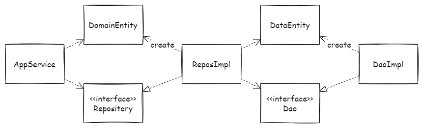

リポジトリとDAOは似ています。どちらもデータストアとアプリケーションコードの間に位置します。

しかしリポジトリとDAOにはやはりどこか違いがありそうです。リポジトリとDAOの違いはどこにあるのか、参考文献からそれぞれの目的を調べてみます。また具体的にリポジトリとDAOをどう使い分けられそうかを考えてみます。

# リポジトリはドメインオブジェクトのコレクション

> A Repository mediates between the domain and data mapping layers, acting like an in-memory domain object collection.   
-- [P of EAA: Repository](https://martinfowler.com/eaaCatalog/repository.html)

リポジトリはエンタープライズアプリケーションアーキテクチャパターンにおいて次のように説明されています。リポジトリはドメインとデータマッピングレイヤをとりなして、インメモリな**ドメインオブジェクトのコレクション**のように振る舞います。

> Conceptually, a Repository encapsulates the set of objects persisted in a data store and the operations performed over them, [...]  
-- [P of EAA: Repository](https://martinfowler.com/eaaCatalog/repository.html)

リポジトリはドメインオブジェクトの永続化に関わる操作を隠蔽しているとも言えます。

> [...]それ自体はドメインに由来しないが、ドメイン設計においては意味のある役割を持っている。これらの構成概念は、モデルオブジェクトを操作できるようにすることで、[...]  
-- エリック・エヴァンスのドメイン駆動設計

また、エリック・エヴァンスのドメイン駆動設計において次のように説明されています。リポジトリの目的はドメインオブジェクトを操作できるようにすることです。リポジトリそのものはモデルとは呼ばないようです。

# DAOはデータアクセスのメカニズムを隠蔽する

> separates a data resource&#39;s client interface from its data access mechanisms  
-- [Design Patterns: Data Access Object](https://www.oracle.com/java/technologies/data-access-object.html)

DAOはデザインパターンのひとつです。DAOはデータリソースのクライアントインタフェースをデータアクセスのメカニズムから分離します。**データアクセスのメカニズム**を隠蔽する点はリポジトリと一致しています。

> The DAO pattern allows data access mechanisms to change independently of the code that uses the data.  
-- [Design Patterns: Data Access Object](https://www.oracle.com/java/technologies/data-access-object.html)

DAOの目的はデータを利用するコードから独立してデータアクスのメカニズムを変更できるようにすることです。

# 一致する点と相違する点

リポジトリとDAOはデータアクセスに関わるメカニズムを隠蔽する点で一致しています。

しかしリポジトリとDAOとでは目的が違います。リポジトリの目的はアプリケーションコードがドメインオブジェクトを操作できるようにすることです。一方で、DAOの目的はアプリケーションコードから独立してデータアクセスのメカニズムを変更できるようにすることです。

つまり、リポジトリとDAOはデータストアとアプリケーションコードの間に位置する点で一致していますが、関心の向きに違いがあると言えそうです。リポジトリの関心はドメインオブジェクトにあり、DAOの関心はデータアクセスのメカニズムにあります。

# リポジトリとDAOの使い分け方

ここで、リポジトリとDAOをどう使い分けられるかを考えてみます。

まず、DAOの実装としてJPA\*やMyBatisを利用します。DAOはデータアクセスのメカニズムを隠蔽するものです。JPAやMyBatisを利用すれば、インタフェースを用意するだけでまさにデータアクセスすることができます。JPAやMyBatisがその実装を引き受けて、これを隠蔽してくれていると考えることができます。

次に、リポジトリの実装としてドメインオブジェクトを構築するサービスを設けます。リポジトリは「ドメインオブジェクトのコレクション」としての振る舞いをもちます。ドメインオブジェクトの構造はデータベースのテーブル構造と同じではありません。従って、（データベースのコンテキストで言うところの）エンティティからドメインオブジェクトを構築する必要があります。リポジトリがその役割を担います。

（\* JPAは本来O/Rマッパーなので、リポジトリとしての役割を期待できます。しかし取り扱いが難しいので私は苦手で深入りを避けています。）

上記を次の図に整理します。

# まとめ

リポジトリとDAOは目的が違います。目的の違いは説明されるコンテキストの違いです。リポジトリはドメイン駆動設計に登場し、DAOはデザインパターンに登場する用語です。

一方で、別々のコンテキストで説明される分、リポジトリとDAOには一致する側面もあります。いずれもデータアクセスのメカニズムを隠蔽します。

リポジトリの目的はアプリケーションコードがドメインオブジェクトを操作できるようにすることです。リポジトリはエンティティからドメインオブジェクトを構築することで、ドメインオブジェクトのコレクションのように振る舞います。

DAOはの目的はアプリケーションコードから独立してデータアクセスのメカニズムを変更できるようにすることです。DAOはクライアントインタフェースを設けることで、データアクセスのメカニズムを隠蔽します。

リポジトリとDAOの使い分け方は隠蔽するメカニズムとアプリケーションコードに対する役割で整理できます。

リポジトリとDAOにはそれぞれ隠蔽するメカニズムがあります。リポジトリはドメインオブジェクト構築のメカニズムを隠蔽して、ドメインオブジェクトのコレクションとしての操作をクライアントに提供します。DAOはデータアクセスのメカニズムを隠蔽して、エンティティを読み書きする操作をクライアントに提供します。

リポジトリとDAOは併せて、アプリケーションコードに対して次の役割と目的をもちます。ドメインオブジェクトの永続化に関わる物理的な操作を隠蔽し、アプリケーションコードがドメインオブジェクトを概念的に操作できるようにします。アプリケーションコードがリポジトリを利用し、リポジトリがDAOを利用することでこれを実現します。

----

# 参考

- [P of EAA: Repository](https://martinfowler.com/eaaCatalog/repository.html)
- [Design Patterns: Data Access Object](http://www.oracle.com/technetwork/java/dao-138818.html)
- [c# - What is the difference between the Data Mapper, Table Data Gateway (Gateway), Data Access Object (DAO) and Repository patterns? - Stack Overflow](https://stackoverflow.com/questions/804751/what-is-the-difference-between-the-data-mapper-table-data-gateway-gateway-da)

<iframe style="width:120px;height:240px;" marginwidth="0" marginheight="0" scrolling="no" frameborder="0" src="//rcm-fe.amazon-adsystem.com/e/cm?lt1=_blank&bc1=000000&IS2=1&bg1=FFFFFF&fc1=000000&lc1=0000FF&t=fukuchiharuki-22&language=ja_JP&o=9&p=8&l=as4&m=amazon&f=ifr&ref=as_ss_li_til&asins=B00GRKD6XU&linkId=246f02c0398d95a5c662752b3d8a6005"></iframe>

<iframe style="width:120px;height:240px;" marginwidth="0" marginheight="0" scrolling="no" frameborder="0" src="//rcm-fe.amazon-adsystem.com/e/cm?lt1=_blank&bc1=000000&IS2=1&bg1=FFFFFF&fc1=000000&lc1=0000FF&t=fukuchiharuki-22&language=ja_JP&o=9&p=8&l=as4&m=amazon&f=ifr&ref=as_ss_li_til&asins=479813161X&linkId=63de5c8fa7c5d2a57183d71e3b75574d"></iframe>

<iframe style="width:120px;height:240px;" marginwidth="0" marginheight="0" scrolling="no" frameborder="0" src="//rcm-fe.amazon-adsystem.com/e/cm?lt1=_blank&bc1=000000&IS2=1&bg1=FFFFFF&fc1=000000&lc1=0000FF&t=fukuchiharuki-22&language=ja_JP&o=9&p=8&l=as4&m=amazon&f=ifr&ref=as_ss_li_til&asins=483997599X&linkId=72ec158d0a1db57be60e76d41a0dadf4"></iframe>
