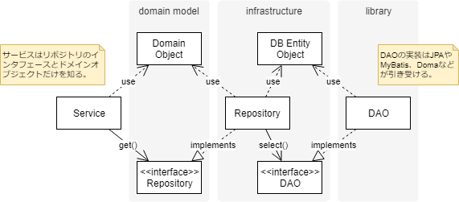

リポジトリとDAOは似ています。どちらもデータストアとアプリケーションコードの間に位置します。しかしリポジトリとDAOにはやはり違いがありそうです。

ここではリポジトリとDAOの違いはどこにあるのか、また具体的にリポジトリとDAOをどう使い分けるのがよさそうかを考えてみます。

リポジトリはドメインオブジェクトのコレクション
----

> A Repository mediates between the domain and data mapping layers, acting like an in-memory domain object collection.   
-- P of EAA: Repository

> Conceptually, a Repository encapsulates the set of objects persisted in a data store and the operations performed over them, ...  
-- P of EAA: Repository

リポジトリはドメインとデータマッピングレイヤをとりなして、インメモリな*ドメインオブジェクトのコレクションのように振る舞います*。

ということは、ドメインオブジェクトの永続化に関わる操作を隠蔽しているとも言えます。

> ...それ自体はドメインに由来しないが、ドメイン設計においては意味のある役割を持っている。これらの構成概念は、モデルオブジェクトを操作できるようにすることで、...  
-- エリック・エヴァンスのドメイン駆動設計

リポジトリの目的はドメインオブジェクトを操作できるようにすることです。なお、リポジトリそのものはモデルではなく設計上存在するものです。

DAOはデータアクセスのメカニズムを隠蔽する
----

> separates a data resource&#39;s client interface from its data access mechanisms  
-- Design Patterns: Data Access Object

DAOはデータリソースのクライアントインタフェースをデータアクセスのメカニズムから分離します。

これは*データアクセスのメカニズムを隠蔽することそのもの*です。この点はリポジトリと一致しています。

> The DAO pattern allows data access mechanisms to change independently of the code that uses the data.  
-- Design Patterns: Data Access Object

DAOの目的はデータを利用するコードから独立してデータアクスのメカニズムを変更できるようにすることです。

一致する点と相違する点
----

リポジトリとDAOはデータアクセスに関わるメカニズムを隠蔽する点で一致しています。

リポジトリとDAOの違いはその目的にあります。リポジトリの目的はアプリケーションコードがドメインオブジェクトを操作できるようにすることです。一方で、DAOの目的はアプリケーションコードから独立してデータアクセスのメカニズムを変更できるようにすることです。

つまり、リポジトリとDAOはデータストアとアプリケーションコードの間に位置する点で一致していますが、*関心の向きが違います*。リポジトリの関心はドメインオブジェクトにあり、DAOの関心はデータアクセスのメカニズムにあります。

リポジトリとDAOの住み分け方
----

さて、リポジトリとDAOをどう住み分けるかを考えます。

JPAやMyBatisを利用することがDAOの実装に相当します。

DAOはデータアクセスのメカニズムを隠蔽するものです。JPAやMyBatisを利用すれば、まさにインタフェースを用意するだけでデータアクセスすることができます。JAPやMyBatisがその実装を引き受けて、これを隠蔽します。

リポジトリの実装はドメインオブジェクトの構築です。

リポジトリにはドメインオブジェクトのコレクションとしての振る舞いをもたせます。ここで、*ドメインオブジェクトの構造はデータベースのテーブル構造と同じでないこと*に気がつきます。従って、（データベースのコンテキストで言うところの）エンティティからドメインオブジェクトを構築する必要があります。リポジトリがその役割を担うわけです。

上記をまとめたものが次のクラス図です。

まとめ
----

そもそも、リポジトリとDAOは同じコンテキストで説明されるものではありません。そのため、ふたつが一致した側面をもっていてもおかしくありません。

逆に、リポジトリとDAOの違いはその説明されるコンテキストにあると言えます。リポジトリはドメイン駆動設計における、DAOはデザインパターンにおける用語です。従ってその目的も違います。

リポジトリの目的はアプリケーションコードがドメインオブジェクトを操作できるようにすることです。リポジトリはエンティティからドメインオブジェクトを構築することで、ドメインオブジェクトのコレクションのように振る舞います。

DAOはの目的はアプリケーションコードから独立してデータアクセスのメカニズムを変更できるようにすることです。DAOはクライアントインタフェースを設けることで、データアクセスのメカニズムを隠蔽します。

リポジトリとDAOの住み分け方として、次のように考えることができます。

DAOはデータアクセスのメカニズムを隠蔽してエンティティの操作をクライアントに提供します。リポジトリはエンティティから構築してドメインオブジェクトの操作をクライアントに提供します。

アプリケーションコードの方から見れば、次のように考えることができます。

アプリケーションコードがリポジトリを利用し、リポジトリがDAOを利用します。リポジトリとDAOは併せて、次の役割と目的をもちます。ドメインオブジェクトの永続化に関わる物理的な操作を隠蔽し、アプリケーションコードがドメインオブジェクトを概念的に操作できるようにすることです。

参考
----

- [P of EAA: Repository](https://martinfowler.com/eaaCatalog/repository.html)
- [Design Patterns: Data Access Object](http://www.oracle.com/technetwork/java/dao-138818.html)
- [c# - What is the difference between the Data Mapper, Table Data Gateway (Gateway), Data Access Object (DAO) and Repository patterns? - Stack Overflow](https://stackoverflow.com/questions/804751/what-is-the-difference-between-the-data-mapper-table-data-gateway-gateway-da)
