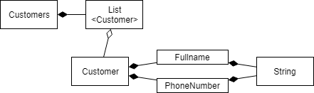

オブジェクト指向を理解するのが難しいのは、システム開発の現場でオブジェクト指向プログラミングを実践することがなかなかできないからだろうなと思っています。

理由はいろいろありますが本題ではないのでそれはまた別の機会に。

## とにかく試してみる

オブジェクト指向の理解を深めるには、*実践的に試行錯誤してとにかくプログラミングしてみる*のがよいと信じています。それは結局、システム開発の現場でオブジェクト指向プログラミングを試してみるということです。

書籍『現場で役立つシステム設計の原則』はその挑戦の指針としておすすめの一冊です。

## クラス分割の理由を考え直す

『現場で役立つシステム設計の原則』第1章には主に次のことが書かれています。

- 変数やメソッドに名前をつけること
- それらをクラスに分割すること
- バリューオブジェクトとファーストクラスコレクション

基本的なことばかりですが、とても示唆に富んでいます。

*業務の関心事を表現することがメソッドやクラスを分割することの動機*であるというのは、言われてみればあたり前のように思えます。しかし、私にとってはそうだよなと思い返させられる観点でした。

学校や仕事場で明確にそう習ったことはないような気がします。

## 業務において特有な点を探す

メソッドやクラスを作成するのは処理を共通化するためだ、と以前は思い込んでいました。そのせいで、共通化を理由にとにかく*スーパークラスを設けたりUtilクラスを設けたりしてしまいがち*でした。

しかし、それはあまりよいやり方ではないのですね。実感としてもあまりうまくいかないなと思います。

オブジェクト指向はむしろ逆のアプローチをする考え方であるように思えます。

オブジェクト指向においてメソッドやクラスを分割するのは、業務の関心事を表現するためです。*共通な点を探すことよりはむしろ特有な点を探すこと*です。

その特有な点をメソッドやクラスに閉じ込めることで、再利用可能な部品を作り出すことができるのだと気がつけば、メソッドの長さやクラスの大きさ、分割の仕方も変わってきそうです。

## 小さなことからはじめてみる

バリューオブジェクトやファーストクラスコレクションのようなクラス分割を知れば、オブジェクト指向の実践は*小さなことからはじめられそうだ*と気がつきます。

業務の事柄をメソッドやクラスとして切り出して、その体を表す名前をつけていくのがオブジェクト指向らしい分割の仕方であると改めて考え直しました。
