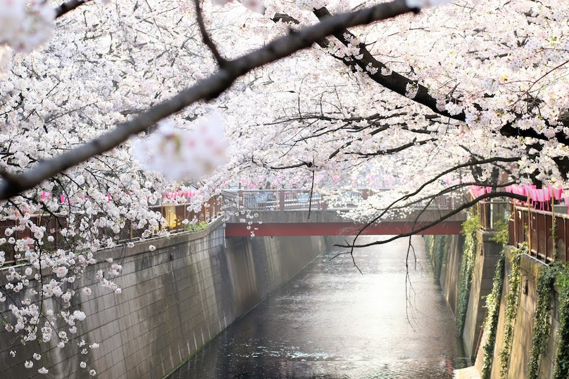
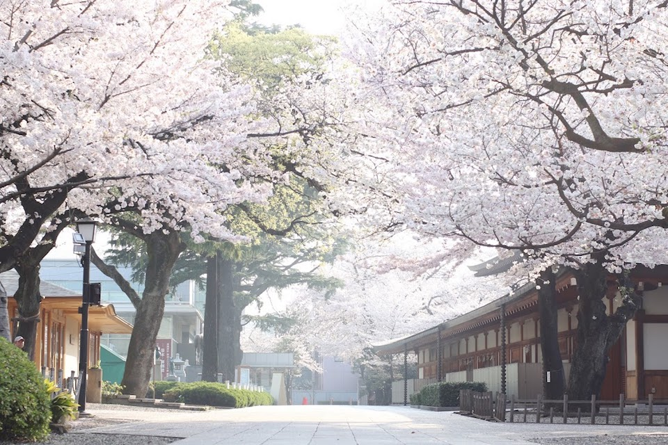
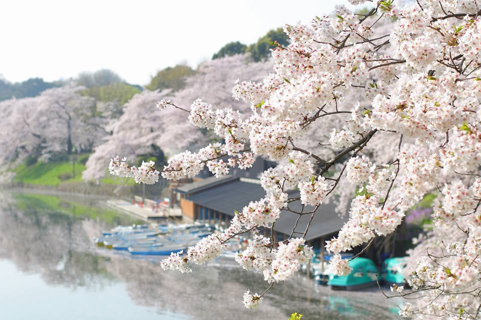
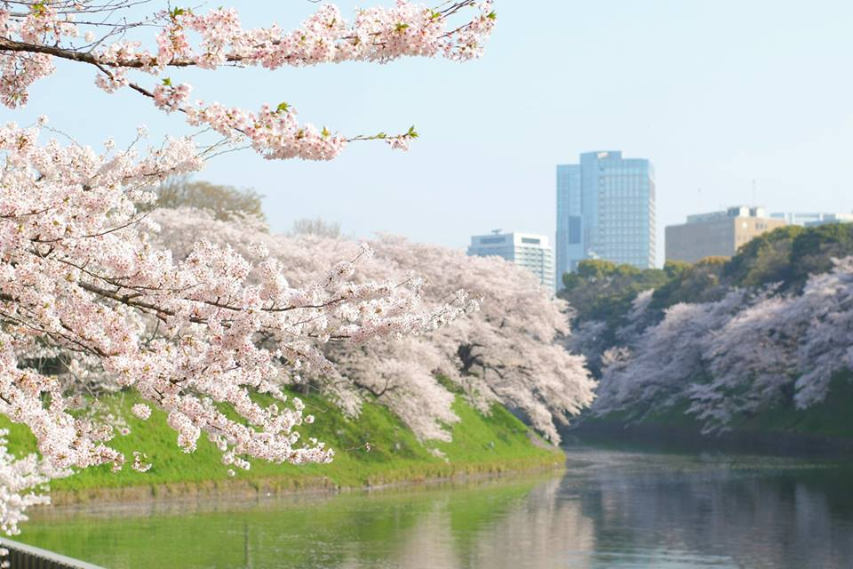
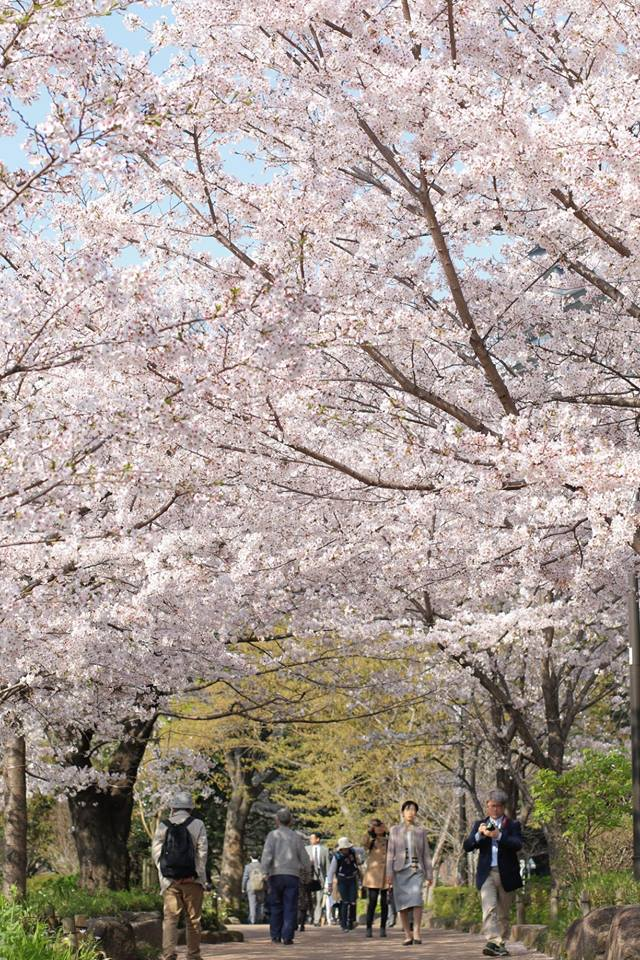
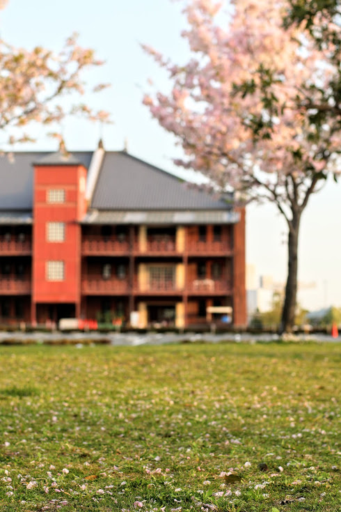
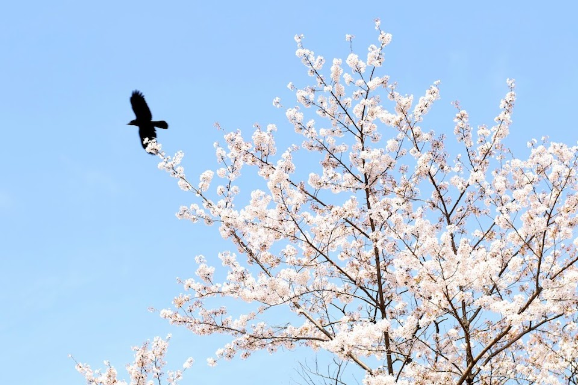

先日、エクストリームお花見出社と称して写真撮影をしてきました。

出勤前です。頑張って3日続けての早起き。朝はどうしても苦手だと思い込んでいましたが、意外といけるものです 😤

## 1日目 3月28日（水曜日） 目黒川

都内の桜と言えば目黒川が有名ですね。

有名なだけに目黒川はものすごい人が集まると聞きますから、それはちょっといやだなと思ってしまします。

でも朝なら人少ないんじゃね？

桜を撮ることができる期間はかなり限られているので、もうそれしかない。朝撮りにいこう。そう考えたら翌日に決行しました。

ライトアップで有名な目黒川ですが、朝もなかなです。目黒川の水面とそれを覆う桜の光が、きらきらと増えていくのがとても素敵でした。

## 2日目 3月29日（木曜日） 靖国神社と千鳥ヶ淵緑道

3日間の中で格段によかったのが2日目の靖国神社と千鳥ヶ淵緑道です。

東京都における開花の標本木は靖国神社内にあります。これはおさえておきたいと思ったので2日目は靖国神社に行くことにしました。

靖国神社を出るとすぐに千鳥ヶ淵緑道が見えます。見た瞬間感動です。広がりがすごい。思わず「わぁ・・・！」とため息が出てしまいました。

靖国神社と千鳥ヶ淵緑道はどちらも桜の見所として美しく、その両方が楽しめる九段下は本当にオススメのお花見スポットです。

## 3日目 3月30日（金曜日） 赤レンガ倉庫と代々木公園

消化不良とちょっとしたイベントをもってエクストリームお花見出社は幕引きです。

山下公園や港の見える丘公園でも桜が見られるということなので、あえて職場とは逆方向のみなとみらいに行ってみました。

が、桜そのものが少なく、なお散り始め。。

どうにも物足りないので、職場近くの代々木公園に寄ることにしました。

代々木公園も都内で有名なスポットなだけに桜はすごかったのですが、同時にゴミとブルーシートとカラスもすごいです（笑）

そろそろ出社するかという時になって、学生時代の友人と6年ぶりくらいにばったり会うことができたのは奇跡でした。なので、3日目もそれはそれでよしということにしたい。

## やってみて思ったこと

*ちょっとその気になれば2時間もの時間が作れた*ということに、正直驚いています。「あれもしたい、これもしたい、でも時間がなくて」なんていうのは完全に甘えだったんだなと思います。時間は作るもの、これは本当ですね。

なお、写真の整理をしていて感じたこと。寄りで撮るさくらもそれはそれでよいのですが、*どこで撮ったか分からないほど切り取ってしまえばおもしろさを欠く*という気づきを得ました。桜をテーマにいろんなところに足を運んだから感じられたことかもしれません。