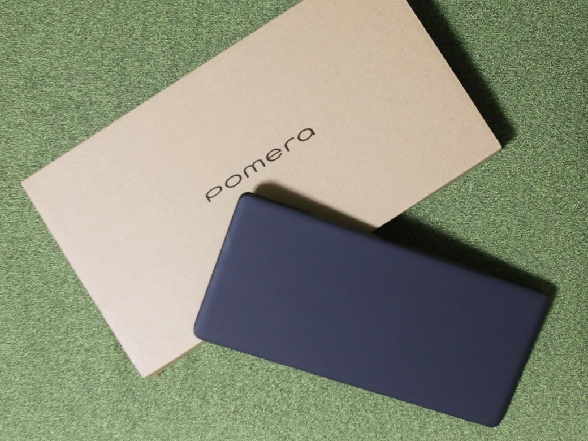

買ってしまいました。pomera。

これほど衝動的にものを欲しくなったのは久しぶりです。であるのに、そもそもなんでpomeraに惹かれてしまったのか、もう忘れてしまいました。きっかけはともかく、欲しい衝動を抑えることができませんでした。

## これはもう本当に潔いものだと思います。

なにせテキストを書くことしかできない端末ですから。今時ノートパソコンだって安くなっているし、タブレットにキーボードを接続することだってできるのだから、あえてこれでなくても、という気はしないでもないです。しかし、だからこそなのかもしれません。

他に何もないからそのことに集中できる、ということは確かにあるように思いました。TwitterやFacebookの通知がブラウザのタブをハイライトすることがありません。うっかりニュース記事のインデックスを覗いてしまうこともありません。

気がつけばよそ事をしているというのはそれなりのきっかけがあるからです。pomeraにはそれがないんですね。やることを束縛してくれる。そうでもしなければ集中することができないのは残念なことでもありますが、そうすることができるからそれでいいのです。

## 計算機というよりはノートを持ち歩く感覚です。

以前、モーニングページを書いていたことがあります。もちろん普通のノートで。その時、傍に置いていたのが電子辞書です。言葉の意味を確認したり、単に漢字を調べたりするためです。スマホでもそれはできますが、専用機である電子辞書を使っていました。

pomeraはその感じに近いかもしれません。書くことの専用機、ノートなのです。ものを書くなら手書きの方がよい、というアナログの感覚は分からないでもないです。しかし頭の中をアウトプットするのにキーボードだって悪いものではありません。

もう20年近くキーボードを使っていれば、打鍵することも筆先を動かすこともそう大差ありません。実際、頭の中で言葉を並べるよりも速く手を動かしているというようなことはあります。キーボードならよそ見をしていたって打てますしね。

## 端末を開けばすぐに書ける状態なのがよいです。

内部的には.txtファイルを作成するようになっているようなので、pomeraにも当然ファイルシステムはあります。それが前面にでてきていないのがよいです。端末を開いて、ファイルの一覧を見せて、ファイルを選択してください、がありません。

pomeraを使うような人は、文字を起こしたいと考えているのだから、当然といえば当然のインタフェースですね。端末を開けばすぐに書くことができる。ファイルシステムすら表に出さないシンプルさが、まっすぐな導線を与えてくれています。

メニューは呼び出した時に初めて表示されるようになっているので、画面を邪魔しません。下部にはファイル名と入力の状態、バッテリーの状態、時計が表示されていますが、これも全画面表示にて隠すことができます。本当に地と文字だけです。

## 文章を書くことが楽しくなりました。

他のことに邪魔されず、ノートを持ち歩くかのよう。徹底してシンプルなインタフェースをもつpomeraは、文章を書くことを楽しくしてくれるように思いました。実際、今こうしてpomeraの使用感を書いているのが楽しいです。（新しいおもちゃを手に入れてハイになっているだけかもしれない。）

やはりなんとなく滞っているブログの更新も（笑）、なんとかしていけそうな気がしています。なんとかしていきたい。頭の中をアウトプットしたい欲求はなぜだかいつだってあるので、よい道具を手に入れたかもしれないと期待しています。

あと、そうそう。ものを書くなら朝がいいですね。pomeraとはぜんぜん関係ないですけど。今もこうして出社前にコメダで小倉トーストを食べながらこれを書いています。pomeraと朝活。少しずつ何かを変えて、アウトプットを増やしていきたいです。
