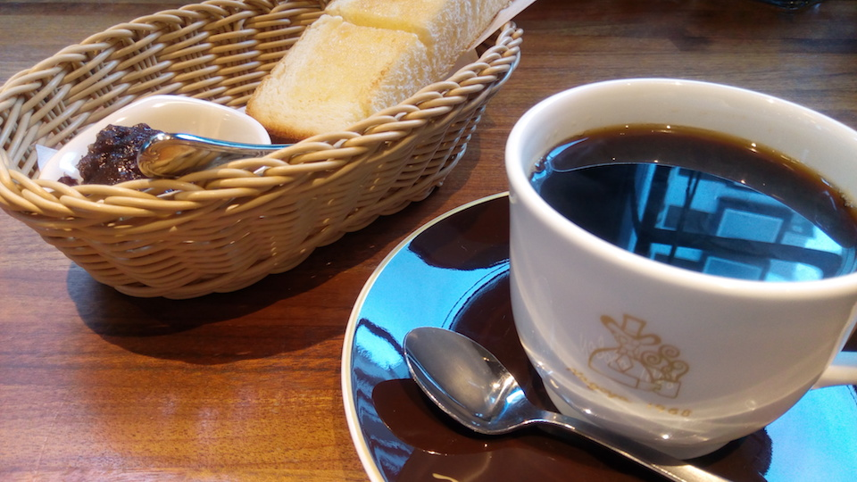

朝活を始めて7日目、思ったよりも続けられています。3日でやめてしまうかもしれないと思っていました（笑）

そうしたい、だから続けられる。
----

これまで、朝は苦手だとずっと思い込んできました。それがやってみると意外に起きることができてしまうのは、そうすることが気持ちいいと感じているからなのでしょうね。

続けられているというよりは、ただ単に気持ちがいい。乗り気はしないけど朝活するのはよいらしいというモチベーションでは、なかなか続けられません。それをするには早起きの壁はあまりに大きいです。

今のところ勉強したりアプリ開発したり、スキル向上みたいなことはしていませんから、義務感みたいなものがありません。きっかけは、人が少ないところで桜を撮りたいと思ったことで、*「そうしたい」をモチベーションに*できたことがよかったのかもしれません。

朝という時間がいい。
----

自分の時間を作るなら朝がいいですね。これは朝活をしてみて強く感じることです。仕事する前の頭はリソースがいっぱいで疲れていません。*疲れていないから壮快*でいられます。せっかくしたいことをするのですから、そういう状態でいたいわけです。

ケリー・マクゴニガルの『スタンフォードの自分を変える教室』でも、意思力は消費されるリソースだと言っています。仕事は意思決定の連続です。たとえそう意識していなくても。そういう時間を過ごしてしまえば、頭のリソースは枯渇します。だから仕事の後になる夜ではだめです。

頭が疲れていると、さぼってしまったり、雑になってしまったり、総じてネガティブな方へ傾くような気がします。そういう状態を自分の時間にあてるのは、普通に考えてもったいないです。ものを書くにしても、愚痴っぽくなってしまうのはよくないですしね。

充実感がすごい。
----

朝、こうやってコメダで小倉トーストを食べながら、pomeraーー新しく手に入れたおもちゃーーで遊んでいると、もうお家に帰ってもいいんじゃないかなと思ってしまいます（笑）

リソースで満たされた頭を朝一で使って、一日でやることはもう済みました、という感覚になるのでしょうね。*自分がしたいことをしてそういう気分になれる*のですから、それは気持ちがいいです。充実感がすごいです。もう帰りたいです。

ある種の満足感を得て仕事に臨むからなのか、仕事中に気が散ってよそ事をしてしまうことも少なくなったような気がします。朝活を勧める記事でみかけるような頭すっきりリフレッシュ感とは違います。ただ早く帰りたいだけです。

毎日がちょっとだけ楽しみ。
----

朝、こうやって自分の時間をポジティブに使って、充実感も得られる。朝活の効果はものすごいぞと実感しています。

特別にアディショナルな時間を与えられているわけではないのに、時間の使い方次第でこうも感覚が違うということに驚きます。毎日がちょっとだけ楽しくなるようにも思えます。

これが、義務感になってしまうとまた違ったものになってしまうのでしょうから、自分がしたいこと、気持ちがいいことにフォーカスして、このちょっとした楽しみをちょこちょこと続けていきたいです。
