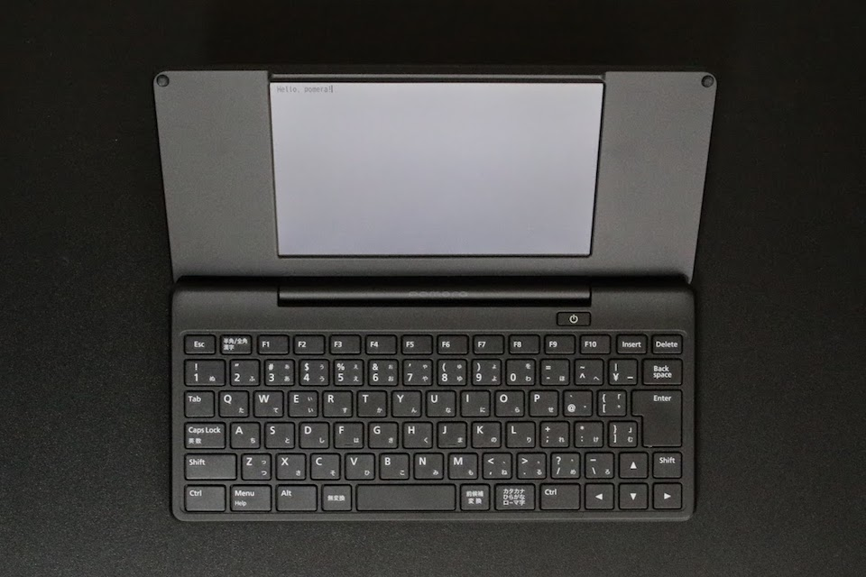

pomeraを使ってみて、ノイズが少ないというのはありがたいことだと思うようになりました。

## pomeraは本当に必要なのか？

pomeraを買おうかどうか迷っていたときに考えたのは、テキストを編集することしかできない道具が本当に必要なのかということです。

Mac Book Airはよいラップトップコンピュータです。薄くて軽い。動作もそれなりで不都合はありません。当然エディタだって備えていますし、足りなければEmacsだってVimだって使うことができます。

そういうものを持っていながら、エディタしか備えないものが本当に要るのかということです。少なくとも、ラップトップコンピュータで足りないということはないはずです。

## 劣っていること、それがpomeraのよさ。

それでも、pomeraを実際使ってみれば、これはよいものだと感じます。pomeraが機能的に優れているからではありません。むしろ逆で、ラップトップコンピュータに比べて、機能的に劣っているからです。

pomeraで文字を書いてみると、道具としてのよさを確かに感じます。まあまあのサイズのキーボードを備えているし、ディスプレイも大きくてテキストを見るには十分。変換だって賢いと言われています。

しかし、これらpomeraの機能や装備の、ポジティブな面が書くことをサポートしてくれている、と言うのは大げさな気がします。pomeraはもっと控え目な存在です。邪魔をしません。逆に機能豊富なラップトップコンピュータの方が書くことを妨げているように思います。

## ノイズ、ノイズ、ノイズ。

写真つきのブログをラップトップコンピュータで書こうとしているとき、目と、手と、意識が、がちゃがちゃと動いてしまっていることに気がつきました。どうにも文字が進んでいきません。なぜなのか。

ラップトップコンピュータの、特に何が足りないと言うことはないです。ただ、意識を持っていく要素を持ちすぎています。

たとえば、言葉の使い方を調べるのに辞書を引くにしても、その間にかなりのものが目に入ってきます。目に入ってしまえば意識がそれます。そのちょっとしたことの積み重ねが、いつの間にか意識を書くことから遠ざけてしまいます。

そういう意識の動き方に気がつけば、*身の回りにノイズが多い*ということにも気がつきます。

特に、ラップトップコンピュータで何かをしようとすれば、まずWebを利用します。Webは広告で溢れているし、広告は意識を持っていくためのものです。その点において、pomeraがオフラインの辞書を備えているのはよくできています。

## pomeraは思考を妨げない。

pomeraが文字を書くのに優れているのは、その劣った機能にあると思えます。最低限にデザインされた機能と装備しか持たないpomeraであるから、書くことに意識を集中させることができます。

これは書くことに限ったことではないなと思いました。WebにしてもSNSにしても、あるいはニュースだって、意識を持っていってしまうものは数限りなくあります。それで気がつけば別のことをしたり、不必要に意識高くなったり、どうしようもなく不安になったりも、できてしまうわけです。

*そういうノイズを拾わないような努力*をしなければ、*思考をまっすぐに進めることも難しい*のですから、*情報社会は過酷*です。

アウトプットを文章で表現したいけど、スマートフォンやラップトップコンピュータでは思うように文字が進んでいかないと感じる人にはぜひ。そんなときはpomeraを試してみてみると違った感覚を得られるかもしれませんよ。