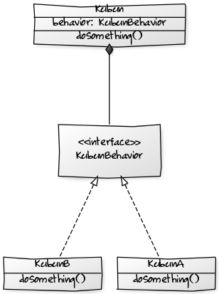

『現場で役立つシステム設計の原則』第2章・第3章の内容は、ロジックをどこに書くかということについてです。

第1章に引き続きテクニカルな内容でアプローチしつつ、第4章・ドメインモデルによる設計への導入になっています。

設計は大事
----

第3章にある「ロジックをどこに書くのがよいかを適切に判断するのが『設計』です」の文が印象的でした。

ロジックをどこに書くかということは非常に大事なことです。よい設計はどこに何が書かれているかを推測しやすくし、要求に対する変更箇所を限定的にしてくれます。

設計のないプログラムは読むのが大変
----

現場経験の中で、悪い設計を見てきました。もちろん人ごとではなく、自分もそれに荷担していました。

初期開発から担当して、追加開発と保守で6・7年携わったプロジェクトがあります。このプロジェクトで本当に苦労したのが、既存のプログラムを読み解くことです。

障害やあやしげな動作を確認すると、既存のプログラムを読み解く必要はどうしてもでてきます。「この前提条件でこの操作をするとこういうことになります」ということの説明が求められるからです。設計書などというものはいつだってあてにならないものです。

また、追加開発をするにしても、仕様変更やバグ修正をするにしても、当然既存のプログラムを読み解く必要があります。追加や変更をプログラムのどこに加えたらよいかを探るためです。

これは非常に困難な作業です。設計がひどいと、*頭からお尻まですべてを解読しなければ仕様を理解できない* こともあります。

ロジックはあちらこちらに分散されています。まずはこれを脳内でコンパイル・実行しなれけばなりません。このインプットならこのアウトプットになると分かって、ようやく仕様の理解に至ります。

設計のないプログラムは設計のないプログラムを増やす
----

ロジックの分散はそれそのものの問題にとどまらず、システムの成長に伴ってさらに問題を大きくさせます。

仕様と仕組みを理解することができると次にプログラムの追加や変更を施します。ロジックはあちらこちらに分散されていますが、納期は短いのです。仕方なくあちらこちらに追加や変更を加えます。このようにして *巨大で脆い張りぼてのようなプログラムができていく* わけですね。

設計は大事（再掲）
----

前振りがながくなりました。そういうことがあって、そういうことにならないようにするにはよい設計をする必要があると考えるに至りました。

つまり、ロジックを適切な場所に置いてやることです。となれば、*仕様を取り決めることと設計をすることは別のことである* ということも理解できます。設計はとても大事なプロセスなのです。

プログラムの形式で業務を定義する
----

そのためのテクニカルなアプローチが、第1章のバリューオブジェクトやファーストクラスコレクション、第2章の区分オブジェクト、そして、業務ロジックを表現する第3章のドメインオブジェクトになるわけですね。

ロジックを適切な場所に置いてやるとは、*プログラムの形式で業務を定義的あるいは宣言的に表現していくこと* のように見えました。

第2章にある早期リターンやガード節は、「この場合はこの戻り値」という定義を明確にします。Enumで表現する区分オブジェクトは「この場合はこの動作をする」ということを表現します。第3章のドメインオブジェクトは業務ルールそのものです。

第3章に書かれているように、UtilクラスやCommonクラスが思ったほど役立たないのは、この逆をやっているからだと思いました。いろんな要求を寄せ集めてしまうから、役割がはっきりしません。使い方も不明瞭で複雑になります。

思考停止してはいけない
----

*「共通」という言葉が飛び出したら思考停止していると考えた方がいい*、というのが現場経験の中で獲得した私の教訓です（笑）

共通な機能を考えるよりは、特有な ~~機能~~ 性質 を表現することを考える方が、結局のところプログラムをすっきりさせることができるということは実感としてあります。それでいて再利用しやすくなるようにも思います。

このことにはじめて気がついたときは不思議な感じがしました。よかれと思い込んでいた「共通ななにか」を考えないほど、逆によく「利用できる部品」ができていくからです。

日々の実践で基本を身につける
----

いちど区分オブジェクトやドメインオブジェクトの実装を試してみると、*ロジックを適切に配置しないプログラムに違和感をもつ* ようになります。増田さんが公開されている数々のスライドやこの本の内容を実践してみることの意味は、確かにあるように思います。

「これは別のクラスとして切り出したいな」という衝動が沸けば、オブジェクト指向な思考をできているかもしれないと思えて嬉しくなります。

それを、特別なこととしてではなく、当たり前のこととしてできてしまうようになりたい。この本にあるような基本的なテクニックを身につけて原則としてして活用できるようになるには、日々の実践あるのみですね。
