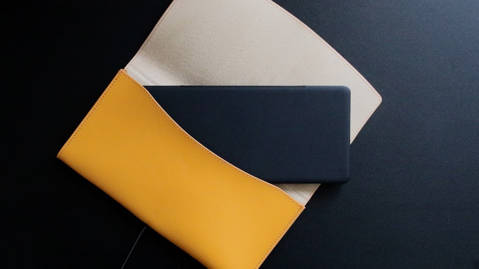
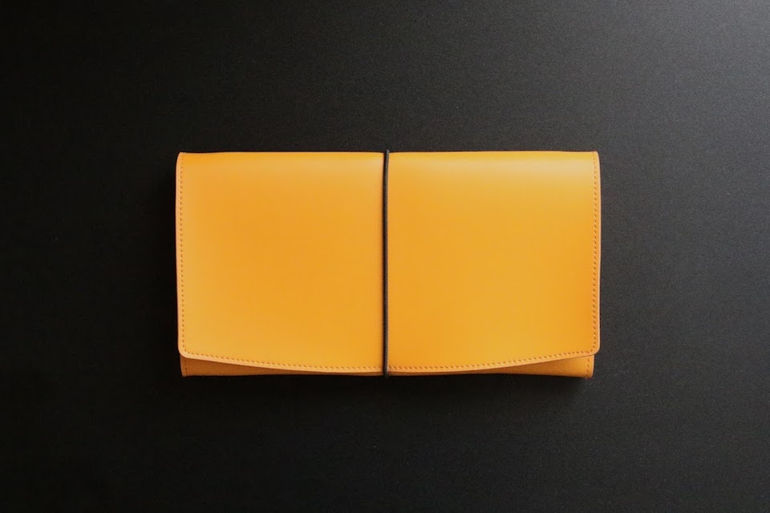

pomeraのケースとしてELECOMのレザーケース（タブレットPC 10.1インチ対応 TB-02LCYL）を買いました。なかなかよいです。これでがしがしpomeraを持ってお出かけできそうです。

鞄に直接入れるのは心配。。
----

最初、pomeraがもともと入っていた白の紙っぽい布袋に入れて持ち歩いていました。汚れは防げますが、衝撃をガードしてくれそうにはありません。

鞄に直接入れて持ち運ぶとpomeraが壊れてしまうかと言えば、きっとそんなことはないと思います。そこまでヤワなものではないと信じたい。そうは思ってもやっぱり気になります。

壊れるからケースが必要だと言うよりは、気になるから必要なんです。電車で人が押し込んできたりすれば、押すんじゃないよという気になって*穏やかではいられません*。

ので、やはりケースは欲しいと思いました。

純正ケースはちょっと。。
----

pomeraにはキングジムから専用のケースが出ています。純正ケースですからね、大きさはぴったりでしょう。パームレストにもなるようです。

要らない。そういうのは要らないんですよ。

パームレストとして使わなかったとしたら、そのための複雑さは無駄になります。そういうものを持ち合わせているというのが気になってしまう。気になってしまうだろうな僕は。そう思ったので純正ケースはなしです。*高いですし*。

純正でなくてもいいよね。
----

調べてみるとすぐに出てきたのがELECOMのレザーケース、TB-02LCです。

どうも大きさがぴったりらしい。シンプルなケースなので、おかしな機構もなさそうです。しかも安い。

到着。さすがAmazonさん、過剰包装で有名なだけあります。でかい。なんでこうもでかい箱に入れなければ気が済まないのか。そう思いながら箱を開けます。が、中の箱もでかい。

え？こんなに大きなものが届いちゃって大丈夫なの。最初見たときはそう思いました。意外とpomeraって大きいんですね。コンパクトとは言えキーボードサイズであるのだから、それはそうか。

大きさぴったり？ELECOMのTB-02LC
----

入れてみるとぴったり！いや、嘘。ぴったりではないですね。縦が若干余る感じがします。

これが専用ケースでないものを探すのに難しいところ。それでも気になるほどの余りではありません。若干です。むしろこれくらい余っている方が締めつけられなくいいようにも思います。横は本当にぴったり。

驚いたのが、生地が結構厚めであること。硬いですし。つくりもしっかりしています。*1,000円で買えたものとはとても思えません*。

難しい機構もないので、構造のせいで壊れてしまうということはなさそう。むしろ頑丈そうです。*持ち運ぶときの心配を和らげてくれるだけの効果はある*と思います。

ただし、噂のゴムは本当にきついです。開け閉めができなくなるほどではありませんが、気になるレベルではあります。開け閉めの度にゴムがきついなと感じるはずですこれは。

それは困りますから、ゴムは外しました。ゴムは差し込んであるだけで外してしまえるようになっています。とても優秀。

つくりもしっかりしてて満足。
----

そういうわけで、ELECOMのTB-02LCYLはかなり満足のものでした。

これでpomeraを持ち運ぶのにびくびくすることはなくなりそうです。持ち運びが気軽でなかったらpomeraの価値は半減してしまうと思いますし。

ふたは本体を覆うほど大きいので、ゴムがなくてもぜんぜん大丈夫です。はねっかえってふたが開いてしまうなんてことはないでしょう。

僕はこれをさらに微熱山丘（SunnyHills）のコットン袋に入れています。気持ちいいくらいにぴったりサイズ。とっておいてよかった。スッと持ち運べますよ。おすすめ。

実は、Nintendo Switch用コントローラーのケースも大きさが合うということなので試してみました。が、だめでした。pomeraの方が少し大きいようで、ぴっちぴちになります。