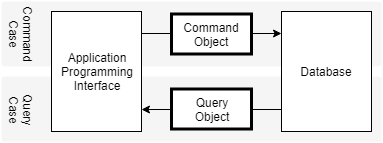
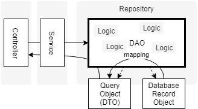
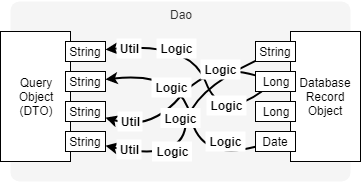
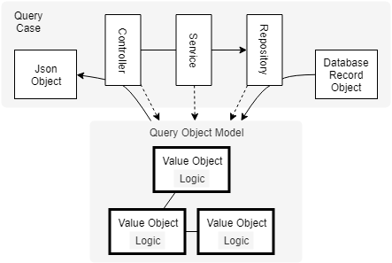

システムの一部機能を改修するテーマが現在進行中です。
テーマは他の箇所に影響がないくらいに分離できるものです。
この大きさが丁度いい。
チャンスとばかりにリファクタリングすることにしました。

アプリケーションはそれなりにレイヤー化されています。
controllerとserviceとrepositoryがある。
よくある３層構造です。
何を見直して再設計するのか？
それは**ドメインオブジェクトモデルの構築**です。

現状のアプリケーションはビジネスロジックをモデリングしたものとは言えない状態です。
自分がやったのだけれど。
しかしだからでもあります。
なぜこうなったかを振り返り、
どのようにできたかを考えます。
失敗から学べることもあるはずです。

## 参照側の層は薄く？本当に？

開発対象のシステムはある情報の検索サイトです。
何の情報であるかは述べません。
今回のお話にもそれは影響しません。
ドメインの詳細が考察に影響しないくらいの設計ミスがある。
ということです。

この情報には操作側と参照側の側面があります。
情報の所有者が情報の属性情報を入力します。
情報の閲覧者が情報の計算や判定の結果を参照します。
操作の都合と参照の都合が異なることは予想できました。
そこで、CQRSを参考に操作用のオブジェクトと参照用のオブジェクトを分けました。
この選択はよかったと思っています。

> This layer reads directly from the database and projects DTOs.  
-- [CQRS Documents by Greg Young](https://cqrs.files.wordpress.com/2010/11/cqrs_documents.pdf)

しかしここでいくつかの判断を誤りました。
参照側は層を薄くしてライトにselect処理するだけだと言われています。
私はよく考えずにこれを鵜呑みにしました。
参照する情報をselectして返却するDAOとそれをそのまま返却するだけのserviceを設けました。
しかしこれは実情にまったく適合しませんでした。

## ビジネスロジックを喰ったFat Reposiotry

検索サイトである性質上、参照には計算や判定を伴う複数の表示表現があります。
一方で情報の操作はほとんどCRUDです。
ビジネスロジックと呼ぶような処理は、操作側よりもむしろ参照側にありました。

それでどうなったか？
Fat Repositoryを生んでしまいました。
controllerやserviceはシンプルに次の層を呼び出すだけにできています。
しかしrepositoryが計算や判定をする処理の所在になりました。
しかも複数の表示表現に応じてその処理は散在してしまっています。

参照側にビジネスロジックはないのか？
いいえ、そんなことはありませんでした。
むしろ参照側にこそ計算や判定がありました。
検索サイトはそう名づけられるくらいには参照側に重要な特徴があります。
と考えることができたはずでした。
しかし*私はアプリケーション構成にしか目を向けることができませんでした*。

## 値オブジェクトに成り損なった共通処理

レイヤーにおけるビジネスロジックの所在以外にも問題はあります。
このシステムは検索サイトなだけに多くの表示項目があります。
参照用のオブジェクトはそのすべてをプリミティブな値のフィールドにしているのです。

アプリケーションはリポジトリのインタフェースを境にあちらとこちらしかありません。
リポジトリの実装は計算や判定など、ビジネスロジックをやる責務を負ってしまいました。
値オブジェクトを設けなかったことで、ビジネスロジックはリポジトリのあらゆる箇所に散在しました。
計算や判定の内容はリポジトリの手続き的なコードを慎重に読み下して始めて分かる状態なわけです。

さらに、参照の都合のためにプリミティブな値を整形することもリポジトリの役目になってしまいました。
プリミティブな値は自身を整形・加工をすることができません。
そこでプリミティブな値をマップする際に共通処理を挟むことにしました。

誤った判断で*値オブジェクトを設ける手を抜いてしまいました*。
その結果、値オブジェクトに成り損なった共通処理ができあがりました。
共通処理を挟み忘れたことによるエラーで障害を招いたこともあります。
これは起こるべくして起こったことです。
ただのStringでは、これがビジネスロジックの結果なのか、整形・加工されたものなのか、これを見るだけでは分からないのです。

----

リファクタリングをするには丁度いい大きさのテーマが現在進行中です。

同じ轍を踏まないよう次のことを意識しています。
まずは**値オブジェクトを主役にすること**です。
計算や判断が値オブジェクトから抜け出してしまっていないか、どの値オブジェクトにあるべきなのか、慎重に検討しています。
参照用のモデルは値オブジェクトの組み合わせであるとしました。
アプリケーションの都合が参照用のモデルに入り込んでいないか、やはりよく見直します。

ドメイン駆動設計としてあるべき基本に振り切ることを徹底してみています。
アプリケーションを実装するための妥協は極力回避します。
特にクラス数やコード量が小さくなるからという理由は却下です。
まずはやってみる。
どうしても困るという判断をしてから崩すことを考えるようにしています。

また、このリファクタリングは若手にやってもらっています。
私は相談とレビューをするだけです。
自分でコードを書くのとは違った見え方をして多くの発見があります。
これがなかなかおもしろいのです。
こうした方がいいんじゃないか、と言うそばから自分で違和感を感じたりします。
別のプロジェクトで自分はこうやって書いてみた、を悪い例として説明することになったりもします。

せっかくの機会なので今回は妥協しないものを作りたい。私たちの挑戦はまだ始まったばかりです。