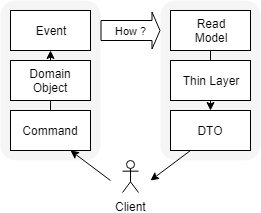

先の記事「[大失敗した設計、そしてドメイン駆動設計の基本に立ち返る](./a-disastrous-design-and-our-challenge-to-ddd)」はツイッターやはてなブックマークの影響で多くの方に閲覧してもらえました。増田さん（[@masuda220](https://twitter.com/masuda220)）に紹介していただいたり、早々にMitsuyuki Shiibaさん（[@shiiba](https://twitter.com/bufferings)）からコメントをいただいたりもしました。ありがとうございます。

気になるコメントをたくさんいただきました。ので、先の記事に少し補足をしたいと思います。

## 参照モデルをつくるもの

参照側の層を薄くしたことが実情に適合しなかった、と書きました。実情に適合せず悪い設計になったことは事実です。しかしCQRSの考え方がまずいと言いたかったのではないです。私が読み間違えて半端な採用をしてしまった、というだけです。

[@shiiba](https://twitter.com/bufferings)さんから次のコメントをいただきました。

> DAOだけにするならクエリ用のDBを別で作って、メインのDBからデータを変換してそのクエリ用DBに投入する部分に業務ロジックが存在しそう。かなぁ。  
-- [@shiiba](https://twitter.com/bufferings/status/1152930894191009792)さん

参照側の層を薄くできるのは、参照用モデルが既にあるからだと考えるべきでした。計算と判定をしたあとの参照用モデルをあらかじめデータベースに用意します。だから層を薄くしてただselectするだけにできるわけです。私はこの参照用モデルを用意せずに、ただ１層のDAOを設けました。ので、DAOがビジネスロジックの溜まり場になるのは当然のことでした。

ここからは少し考察です。参照側の層を薄くするために参照用モデルをデータベースにもつとします。Event Sourcingでこれを実現するのがひとつの手だと思います。実際、CQRSはEvent Sourcingと同じに説明されることが多いです。しかしCQRSはEvent Sourcingとセットでなければ採用できないものではないです。正規化したテーブルと正規化を崩したテーブルをもつのも手だと思います。

ここで、元がイベントストアであっても正規化したテーブルであっても、参照モデルへの変換が必要です。この変換は計算や判定を伴う重要な箇所になるはずです。ビジネスロジックをモデリングすることができるものであるように思えます。[@shiiba](https://twitter.com/bufferings)さんも「クエリ用DBに投入する部分に業務ロジックが存在しそう」とコメントくださいました。

ここで疑問があります。CQRSの概要図において、ドメインオブジェクトがイベントストアの前にだけある絵ばかりを見ます。イベントストアのあとにもドメインオブジェクトはありそうにも思えます。どうなのでしょう？詳しく知らないのですが、**akka**はそれをやるのに有用でしょうか？気になっている技術のひとつです。勉強しなければ。

## 実装パターンよりもドメインモデルの実装

[@katzchang](https://twitter.com/katzchang)さんからは次のコメントをいただきました。

> 基本は「ドメインモデルが素直に実装されてるか」だと思うんだよね。実装パターンで語らない状態にしたい。  
-- [@katzchang](https://twitter.com/katzchang/status/1153103149978177537)さん

まさにこのとおりだと思います。ビジネスロジックをコードで表現できていることが大事です。それはドメインオブジェクトモデルが構築できているということです。

コードを慎重に読み下してようやくルールが見えるのはよくない状態です。ドメインオブジェクトモデルが構築できてさえいれば、極端な話、controllerの比重が大きくてもrepositoryの比重が大きくても問題にならなさそうです。と言うより、いずれの比重も大きくならないのかもしれません。実装パターンに目を奪われないこと。*ドメインモデルが素直に実装されているか*、が基本ですね。

## 自分のドメインの語彙を抽出するのは自分

また[@ilyaletre](https://twitter.com/ilyaletre)さんからは次のコメントいただいた。

> コンポーネントをレイヤ化するところは所与の語彙があるのでそれを助けにパターンの適用ができる。けど、自分のドメインは自分で語彙を抽出しなきゃいけないので設計が後手になるとか？  
-- [@ilyaletre](https://twitter.com/ilyaletre/status/1153430330151280640)さん

まさにこのとおりだったと思います。ぐうの音もでません。目の前の、見えるものに飛びついてしまいました。レイヤー化等のパターンを適用したとき、ある種の満足感を得てしまったのだと思います。

頭を使うべきことはシステム化対象のドメインを形にすることです。悩んだり迷ったりしてリファインしていくものです。レイヤー化などはその準備でしかありません。頭を使うことは苦しいことです。*自分のドメインは自分で語彙を抽出する*、大事な心構えですね。

----

今リファクタリングする機会を得てはっきりしました。うっかりしていたらやらかしてしまいましたわ。この箇所は意図していない、よくない形。こうすればもっとよくなるはず。この感じを書き綴ってみたのが先の記事「[大失敗した設計、そしてドメイン駆動設計の基本に立ち返る](./a-disastrous-design-and-our-challenge-to-ddd)」です。びっくりするくらい閲覧していただけました。

同じようなことやってしまいましたわ、というコメントもすごく嬉しかったです。仲間ですねｗ 誰かの**ハンガーフライト**ネタにでもなれたらいいなと思います。

失敗談の公開がこんなにも多くの方に共有されるとは思ってもみませんでした。コメントもいっぱいいただきました。なるほどと思ったり、ハッとさせられたりしました。自分が誰かの役に立つよりも自分が得たものでいっぱいです。体験はどんどんアウトプットしていこうと思いました。