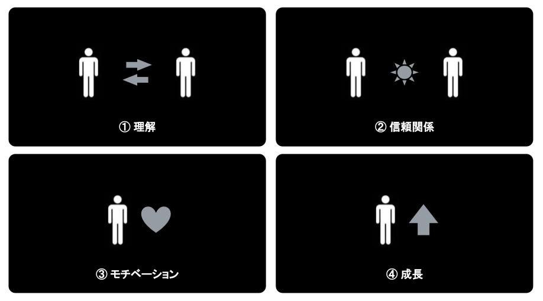

今回は1on1について考えたことを書きます。1on1を実施するにあたって自分のために整理したものです。私は今、プロダクト開発部・開発課でリードをしています。開発課はシステム開発に携わるチームです。

1on1の成果や意義を改めて考えたのには理由があります。チームのメンバーにフィードバックを求められたからです。さて、どうやってやろうか？

巷では1on1というものをやっているらしい。この程度のことで要望に応えると言うのはあまりにお粗末です。"世間的に実施されているから"では理由になりません。ですから、自分（たち）の課題に適合するものでなければならないと考えました。

## 1on1をする背景と目的

ソフトウェア開発に携わるエンジニアが求められる仕事の範囲は広く及びます。SEだから、PGだから、という分業は現実的な実践のかたちではないと思っています。現場をそのようにするつもりもありません。よく言えばエンジニアは臨機応変に状況に対応することを期待されています。悪く言えば**期待されている役割りが曖昧**だとも言えます。

そんな中でも仕事に対するモチベーションを保っていたい。スキルアップや成長をすることを考えたい。そうであるなら、**自分で自分の課題を発見する**必要があります。

しかし目の前の仕事に取組みながらチームの目的や自分の役割を意識するのは容易ではありません。目の前のことに集中すれば視野は狭くなってしまいます。しかしこれは仕方のないことです。

なので時には振り返りをしたいわけです。向き直りをしてやり方や考え方を変えてみたりしたい。*1on1はその手伝いをするためのもの*であると考えることにしました。査定面談や目標管理、上司からの指示にならいように注意しましょう。

## 1on1のかたち

1on1を実施する前に自分で自分がやろうとすることの形式を理解しておく必要があると考えました。形式を理解しておかなければ振る舞いがぶれてしまうからです。

コーチングとティーチングとフィードバック。この３つを1on1におけるコミュニケーションの形の基本にしてみます。

### (1) コーチング

コーチングとは引き出して本人に課題を解決してもらおうとする方法です。目当てを明らかにしたり課題を発見したりするのを手助けします。

思考を整理できないと解決策を導きづらくなります。課題を解決するだけのスキルを既にもっていてもそれを実践できなかったり、自分のよさに気がつかずそれを活かせなかったりします。目的地や道筋をはっきり見ることができなければ迷うのは当然です。ものの見方を助言することで目当てや課題の輪郭を本人に描いてもらいましょう。

自分で考えて自分で正解らしいもの見出せられれば、気づきや納得感をより大きなものにできます。**正解をいきなり与えてしまうとその過程を省いてしまいます**。なので本人が自分で考えることを邪魔したり強制したりしてはいけません。

### (2) ティーチング

ティーチングとは教えることで本人の課題を解決しようとする方法です。課題を解決するための具体的な方法や知識を与え教えます。

知識領域やこれまでの経験によっては課題の解決に至らないことがあります。最初の発想がなければ知識を調べることもできません。経験がなければ考え出すことすらできないこともあります。誰でも初めてのことは知らないですし未経験です。知識や経験の問題なら教えてもらって解決してもいいでしょう。

しかし**本人が自分で調べたり考えたりすれば分かることなら自分で調べて考えてもらうべき**です。調べ方や考え方が分からないなら調べ方や考え方を教えることができます。課題の解決を急いで本人の学びの機会を奪ってはいけません。

### (3) フィードバック

フィードバックとは伝えることで相手に気づきを与えるための方法です。相手が知らないことや気がついていないことを伝えて新たな洞察のきっかけを作ります。

自分の立ち位置や期待される役割を自分では洞察しづらいものです。目の前の仕事に集中していればチーム全体のことは目に入らなくなります。できないことが続けば不安になってしまうこともあります。チームの中における本人の立ち位置や周りのことなどを知れば、自分のやるべきことや意識すべきことが見出せるかもしれません。

1on1におけるフィードバックの目的はあくまで気づきです。**本人が自分でできていないと分かっていることをくどくど伝える必要はありません**。また思いつきの評価を与えてもいけません。気づきのための新たな知見を与えられるものになっているかを振り返りましょう。

## 1on1に期待する効果

本人の成長は1on1に期待する最後の効果です。成果より成長に目を向けましょう。成果に目を向けるとできないことに焦点を当て、やり方や考え方を強制したくなってしまいます。さらにできないことをくどく伝えれば本人のモチベーションを下げます。また一方的な押しつけは相手の反発を招いてしまうかもしれません。

**自分で気がついたり見出したりするには動機が必要**です。内からの動機がなければ外からの知識や情報も聞き流されてしまいます。動機は理屈だけで形成されるものではないように思います。ふとしたことで動機が湧くこともあります。**与えることよりも引き出すことを考えるのがよさそう**です。

話していることに聞く耳をもってもらうには信頼関係が必要です。信頼関係がなければ話していることをそもそも聞いてもらえません。単純接触効果というものがあります。繰り返しの接触が好感や印象をよくする効果です。会話の数を増やす意味でも1on1にはそれなりの効果があるかもしれません。

動機にしても信頼にしても、感情を簡単に制御することはできません。期待はできても確実に作り出すことはできない。できることといえば相手を理解することです。また自分を理解してもらうことです。お互いを理解することは信頼の礎にもなるでしょう。

相手の成長をいきなり1on1の効果として考えない方がよいように思いました。**相互の理解が最初**です。まずは足元を固めましょう。

## 1on1で話すこと

お話の対象をあらかじめ考えておけば話題を挙げるのに困らなさそうです。本筋は自分の仕事のことやキャリアのことだと思います。職場で起こっていることや個人的なことも話題にできます。

- 自分の仕事のこと
  - 今取り組んでいること
  - 困っていること
  - 妨げになっっているもの
- 職場で起こっていること
  - 気になっていること
  - 気がついたこと
  - 試してみたいこと
- 個人的なこと
  - 嬉しかったこと
  - 不安になっていること
  - 悩んでいること
- キャリアのこと
  - 強みと弱み
  - やりがい
  - やってみたいこと

職場で起こっていることは特に取り上げてみる価値がありそうです。自分の周りで気になっていることや気がついたことを話してもらいましょう。それは**本人の意識がどこに向いているかを示すもの**です。本人の価値観が透けて見えるかもしれません。"あなたの価値観はどんなものですか"と直接問うよりは話しやすい切り出し方だと思います。

## まとめ

1on1について調べたことや自分の中の整理を書いてみました。

- あくまで本人の成長やモチベーションのために1on1を実施する
- 信頼関係や相互の理解を1on1の効果として最初に考える
- 何を与えて本人にどうなってほしいかを理解したうえで1on1を実施する
- コーチングとティーチングとフィードバックを効果的に使い分ける
- 位置づけや役割りを示して本人の課題の発見や解決を手助けする

私はこれまで1on1について深く考えず重要視していませんでした。普段の仕事の中で会話できればこと足りると高を括っていました。しかしフィードバックを逆に受けて考え直した1on1を整理してみることで、意図的なコミュニケーションの大事さに気がつきました。

リモートワークが当たり前になった今、コミュニケーションの在り方はより慎重なものになったように感じます。自分のやるべきことをきちんとやらないとなと思いました。