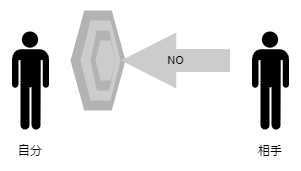
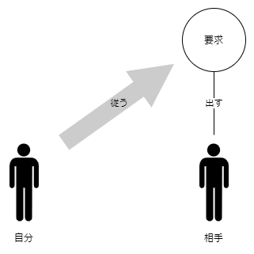
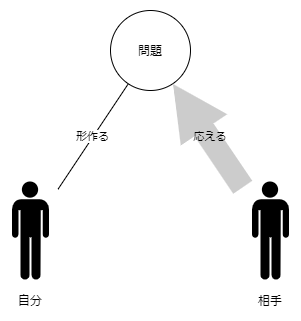

> 受け身にならず先手を打ち、本当の問題に立ち向かう。

たとえば対外折衝に立っているとしましょう。自分にとって都合の悪いことがあります。手がかかることだったり、時間がかかることだったり。あるいは解決が困難で見通しが立たないことかもしれません。簡単に言えば面倒なことですね。さてどうしていきましょうか。

## 相手にNOと言われたくない？

想像します。相手が面倒なことをつきつけてくるかもしれません。あなたは恐怖します。つきつけられたくはないと考えます。なくて済まされるならそれにこしたことはありません。

あなたは都合の悪いことを話題に出さないようにします。あるいは遠回しな言い方をしてみます。その時の会話をなんとか乗り切ります。流されていくだけの資料を準備して、実際に会議はなんとなしに済まされていきます。面倒なことを相手につきつけられることはありませんでした。会話の雰囲気は良好。問題はないかのように思えます。つきつけられることはなかったのだから。安心できましたね。

しかし気がつけば時間だけが過ぎてしまっています。あなたは言い訳をします。相手はNOと言っていない。そして気がつきます。相手はYESとも言っていない。相手は何も言っていないのです。それは当然です。相手に何も言わせようとしなかったのだから。面倒なことはありませんでした。しかし前進もありませんでした。

## 曖昧にして結局は先手を打たれる

相手はしびれを切らします。いったいどうなっているのか？説明を求めてきます。この事態になっていることについて。何も決まっていないことについて。何も前進していないことについて。あなたはようやく気がつきます。これこそが面倒なことだと。

求められた説明は慎重でなければいけいけません。慎重でなければNOをつきつけられてしまいます。**やり過ごすことはできません**。なにせ説明を求められているのだから。説明を求められたから説明する義務が生じました。相手が先に要求して自分が従う関係。従わざるを得ない状況。これこそ面倒です。しかし**こうなってしまってはもう遅い**のです。

面倒を避けて、だから面倒なことになりました。避けていても問題はなくなりません。見ないようにしても問題は確かにあります。放っておいて解消されることを期待するのはいいです。しかし解決しなければ問題はありつづけます。そのツケを払うのは自分です。そのつもりでいなければいけません。相手も馬鹿ではないのだから、曖昧なままにしてはおけません。はっきりせよといずれ要求されます。**要求されれば従うしかありません**。

## 自分から本当の問題に立ち向かう

問題とは何か。NOと言われないようにすることでしょうか。否。それは始まりです。問題はその先にあります。先にある何かを明らかにして形を作る必要があります。自分の都合があって、相手の都合もある。自分と相手との間には関係があります。問題の対象でつながっているのです。

自分のNOを明確にする。相手のNOも明確にする。それは問題の対象を明らかにすることです。形を作る。それはスケジュールなのかもしれないですし、体制図なのかもしれません。いずれにしてもはっきりとした形で示す。**それで初めてYESなのかNOなのかを考えはじめることができます**。NOを言わせて解決できれば譲歩にもなります。先手を打った方が形作っていくことができるわけです。

NOと言われてから話が始まる。説得なのか妥協なのか強制なのか。言葉だけ丁寧にしても何にもなりません。はっきりとした形で示す。先手を打つ。**相手が応えてもらえる状況を自分が作っていくのです**。