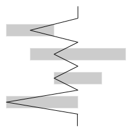
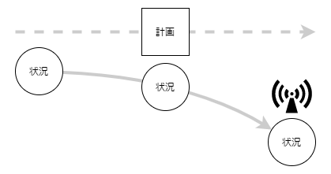
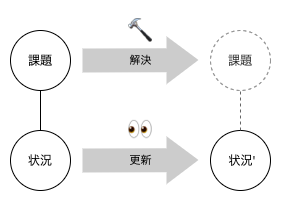

> 進行の不調に気づき、不調の裏の課題を発見する。

プロジェクトが始まれば計画書を作ります。背景と目的、目標の範囲、スケジュール、体制とコミュニケーション計画。目下の課題とそれを解決するための作戦もあるとなおいいかもしれません。キックオフでメンバーの調子をあげられるとさらによいですね。さてプロジェクトは始まったばかり。

## 何人日遅れています？

進捗会議を週次で実施することにします。メンバーがその週したことをそれぞれに報告します。ふむふむみんな取り組んでやれているようだ。オンスケ、オンスケ。あなたは安心しました。

やがて遅れが何人日であるという報告を受けます。遅れているつもりがあるならなんとかなるだろうか。なんとか取り返すつもりではいるようだ。問題の意識を共有したところで会議は終了しました。

ところが翌週も同じような報告を受けます。報告は線表と乖離していて何をしているのかさえ分からなくなってしまっています。遅れは総じて何人日に相当しているのか。計画とはいったいなんだったのだろう。

## 計画と状況のズレは不調のシグナル　

プロジェクトを管理するなら心得ておきたいことがあります。それは**プロジェクトの進行は計画のとおりにならない**ことです。繰り返しでないのがプロジェクトです。予想外のことは起こるわけです。

ならば計画を立てることに意味はないのでしょうか？いや、そんなことはない。計画を立てるから予想外のことが成立します。だから計画を立てなくてよいということではありません。むしろ、だから、計画を立てるわけです。**計画を立てることはそのとおりにならないことを認めること**です。計画と状況のズレに気がつくことは目標の達成に近づくことでもあります。

センスがよければ目標達成へのイメージを肌で感じられるかもしれません。それは経験の世界かあるいはアートの世界です。が、ほとんどの人にそれは難しい。しかしあなたは**計画を立てることができます。計画を立てるから計画と状況のズレを観測することができます**。計画と状況のズレはシグナルです。シグナルによって進行の不調に気がつけます。

## 課題を見つけて手立てを講じる

進行の不調の裏には具合の悪い何かが潜んでいます。どこかで見積もりを誤ったか、あるいは見落としがあったか。**結果的に何かがプロジェクトの進行を妨げています**。それは解決すべき課題です。

課題の本質は何か。不確実さでしょうか、やり方でしょうか。いずれにしても**今の状況を変える必要があります**。課題を解決できなければ来週以降も遅れの報告と頑張りの表明が続きます。課題を置いたままにして状況がよくなることはありません。

プロジェクトの管理は活動の管理です。メンバーの活動は進行の状況に現れています。**今の状況の延長線上に目標の達成をイメージできるでしょうか**。できるならその状況を継続できます。できないなら何らかの形で状況を変えなければなりません。