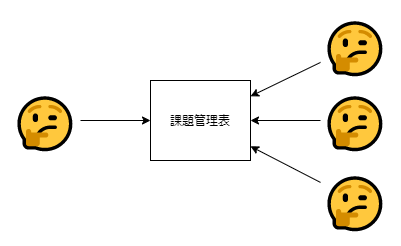
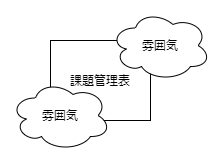
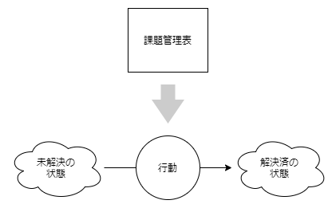

> 事態を把握して、変えるために動く。

プロジェクト進行状況がよくない。しかし何がどうなっているのかが分かりません。あなたは定例会議を開くことにしました。今のままではよくない。状況の認識をみんなで合わせられるようにしよう。

## 課題を挙げてください？

課題を共有しましょう。それぞれの課題を挙げてください。あなたはプロジェクトのメンバーにお願いします。現場の困難はメンバーが理解しているだろう。まずはそれを知っておきたいと思いました。

課題はいくつか挙がりました。順調でない割りには挙がってきていないかもしれないな。挙がっていないところはうまくいっているということか。挙がっていることについては少なくとも順調でないのだ。まずはそこから見ていくことにしようと思いました。

課題は重要そうなものから枝葉のようなものでありました。この課題はあまり重要ではなさそうかな。優先度列を設けて順位づけします。分類もあった方がよさそうだ。カテゴリ列を設けて分類します。これはなんだかいけそうな気がする、そう思いました。

## 雰囲気が見えてくる、しかし

では次の課題の状況を教えてください。プロジェクトのメンバーは答えます。今これこれ作成中で先方の回答待ちです。何日頃に終えられそうですか。今週末までには。分かりました。金曜日、と。

どことなく危なげな感じがしました。しかし各課題には期限を設けられています。優先度も示しました。分類ができて見通しもいい。どのあたりの具合が悪いのかがようやく分かってきました。なんとかなりそうだ。

では次の課題の状況を教えてください。なんだろうこれは？先週も同じことをしたような気がする。何日頃に終えられそうですか。あれ？どうしたんだろう。分かりました。来週の火曜日か水曜日、ね。

## 行動だけが事態を変える

課題は解決するための対象です。様子を見ただけで事態が改善していくことはありません。課題が解決されていなければ解決した状態にするための、**具体的な行動が必要**です。

**定例会議で様子を知れて満足できるのは自分だけ**です。現場の困難はメンバーがよく知っています。それを定例会議で発表させられても困惑するだけです。結局ものごとは先に進んでいないわけです。

**次に執るべき行動を定めることが課題管理表を書く動機**です。課題管理表は現状の問題を可視化します。それを見たなら次の行動を決定しなければなりません。よく見て、定めて、的確に行動する。自分でことの事態を把握して自分がそれを動かしていくのです。