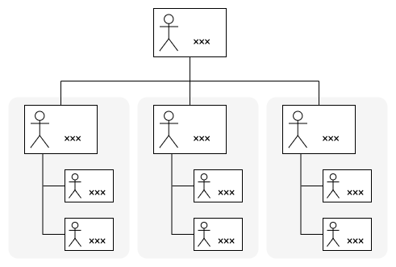
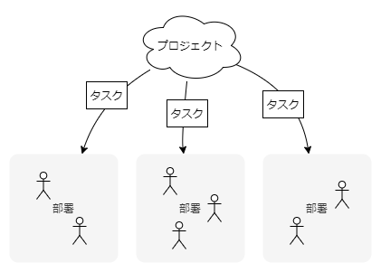
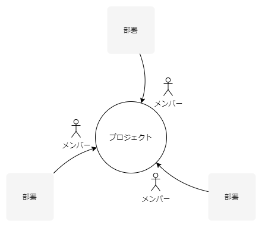

> プロジェクトでメンバーが仕事できるよう、部署から人を調達する。

プロジェクトは立て直しを迫られています。そのためのキックオフが開かれ、体制図が示されました。役割の表記が気になります。実態と合っていない？この体制図は何を表現したのでしょうか。

## 活動を統合するのは誰か

定例会が開かれました。プロジェクトは終盤を迎えています。課題管理表を議論の中心に会議は進行しました。ファシリテーターがひとつひとつの課題の状況を聞きます。担当者が聞かれた状況を答えます。するとファシリテーターが聞いた状況を課題管理表に記載しました。

課題やタスクはそれらしく挙げられています。それぞれに担当者が割り当てられました。みんなサボっている風ではありません。それぞれにタスクをこなしているように見えます。しかし前進していない。プロジェクトとして、ものごとが進んでいないのです。

それで次はどうするのでしょうか？誰が何をすることになりましたか？来週にはどうなっていたいですか？方針は何ですか？目的は何ですか？プロジェクトの活動を統合する役割をやる人がそこにはいませんでした。

## 部署にタスクが分配される

なぜでしょうか。個々のメンバーは動いています。その割にプロジェクトは進行しません。統合する人がいないからでしょうか。恐らくそうでしょう。しかし、それだけではありません。ある意味「自然と」統合されていかないのには理由がありそうです。

体制図はありますか？役割分担はできていますか？それは単に部署を挙げたものではないですか？だとすればプロジェクトの体制図のようなそれは組織の構成を表しているに過ぎないかもしれません。そして**その表現物はそこにいる人たちの意識や理解の現れ**でもあります。

体制図を描いた人はイメージしなかったでしょう。要員をプロジェクトに任命する想像（メンバーをプロジェクトにアサインするイメージ）をしなかったでしょう。だからプロジェクトで生じるタスクは部署に分配され、担当者は部署においてタスクをこなしました。プロジェクトの活動を統合すべきリード担当者でさえそうしているかもしれません。**それぞれがそれぞれのタスクを持ち分として「消化」している**わけです。

## メンバーをプロジェクトにアサインする

**体制図はプロジェクト計画の中でも重要**です。人をプロジェクトのメンバーに組み入れます。メンバーをサブプロジェクトや分野の担当としてサブチームに分割します。メンバーからサブチームのリード担当を選出します。各サブチームや各メンバーの任務、指示と連絡の経路を明らかにします。

**メンバーはプロジェクトの枠組みで仕事をします**。人をプロジェクトのメンバーに組み入れるのであって、プロジェクトのタスクを部署に分配するのではありません。タスクが分配されれば目的が希薄になります。手伝いのようにタスクに当たるのではありません。

**誰を何の仕事に当てているかを把握しているでしょうか**。プロジェクトで体制を明確にします。部署で人の管理と調達をします。そう考えれば縦と横の構造も理解できます。誰が何の仕事に当たっているのか。きちんと体制を組んで把握します。