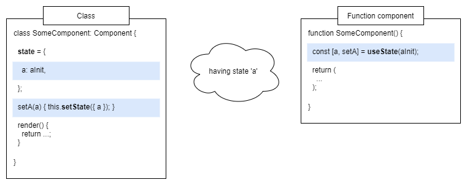
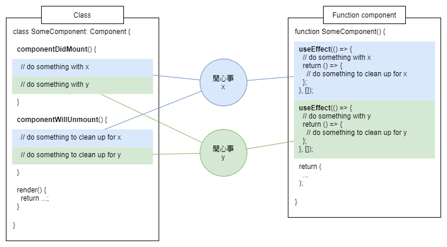
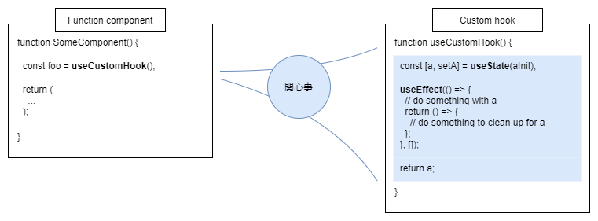

最近は仕事でコードを書くことが減ってしまいました。触れていなかったフックが気になっていて。なので、少し勉強してみました。

後から気がついたのですが、職場で開発しているプロダクトのコードでは既にフックを使っていました。楽しそうだなあ。

## 関数コンポーネントでステートと副作用を扱える

Reactではコンポーネントを組み合わせるようにしてページを実装します。コンポーネントはレンダーのサイクルを跨るステートを持つことができます。コンポーネントを関数で書くこともできますが、この関数コンポーネントはステートを扱えませんでした。そのために小さなコンポーネントでもクラスで書かなければならないのは面倒でした。

フックを使うと関数コンポーネントでもステートを扱えるようになります。副作用としてレンダーのサイクルに干渉できるようにもなります。つまり**クラスでできることと同等のことができるようになる**のですね。

## ある関心事を凝集した定義にできる

クラスには副作用を記述するためのメソッドが用意されています。`componentDidMount`や`componentWillUnmount`などです。たとえば購読の開始とそのクリーンアップをそれぞれのメソッドに書きます。

ここで問題があります。`componentDidMount`と`componentWillUnmount`それぞれのメソッドに書くわけなので、ある関心事についてのコードが分散してしまします。購読の開始とクリーンアップの手続きをひとつのファイルに書くことはできますが、その呼び出しを`componentDidMount`と`componentWillUnmount`に書く必要があります。

また、ステートは`.state`プロパティに持つので、複数の関心事が混ざります。なので`setState`はマージしてステートを更新するわけです。

フックを使うとある関心事をより凝集した定義にできます。たとえば購読の開始とそのクリーンアップは`useEffect`で一度に定義できます。ステートは`useState`の戻り値で得られるので`.state`プロパティに囚われなくなります。ここで、**フックはある関心事をレンダーのサイクルに結びつけるもの**と理解できます。

クラスではある関心事をサイクルの中に自分で結びつけていかなければなりません。ステートにしても副作用にしてもある関心事をクラスにねじ込むような感じがしますね。

## カスタムフックが美しい

フックは関数のトップレベルに書くルールがあります。これは実行の順番が保たれる必要があるためのようです。たとえば`if`文などを使って条件つきでフックを呼び出してはいけません。それが守られれば一連の定義をカスタムフックとしてひとつの関数に切り出せます。

これが非常に強力です。クラスでは`.state`や`componentDidMount`に定義や呼び出しを分散せざるを得なかったものが、ひとつのカスタムフック（関数）の呼び出しで済ませられるようになります。**ステートや副作用に関するロジックを再利用しやすくなる**わけです。

ある関心事を抽出したものがカスタムフックと言えそうです。フックの仕組みがそのような切り出しを可能にしていますが、またそれ自体がフックであるとするのにある種の芸術美を感じすね。[公式](https://ja.reactjs.org/docs/hooks-custom.html)にも次のような説明があります。

> カスタムフックはReactの機能というよりは、フックの設計から自然と導かれる慣習のようなものです。

----

フックは関数コンポーネントでもステートや副作用を扱えるようにするものです。クラスに比べて、ステートや副作用を関心事に基づいて書くことができます。フックがレンダーのサイクルと関心事を結びつける役割を担うからです。また**その記述をカスタムフックに抽出できる**ことが最大のポイントだと思います。[公式のFAQ](https://ja.reactjs.org/docs/hooks-faq.html)でも「カスタムフックに抽出」と何度も言及があります。

**関心の分離**や**高凝集/疎結合**はプログラミングの重要なパラダイムだと思っています。フックをそのための仕組みだと捉えるとコードをよりエレガントなものにできる気がしてきますね。