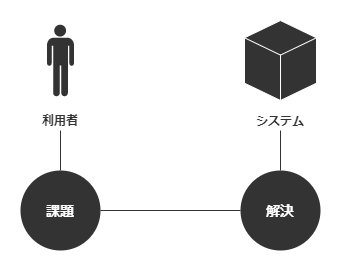

要望と要求と要件の関係を調べると、ベン図を用いた表現を見ます。学生の時に要求工学を履修しましたが、そう習ったのだったか。今ではもうよく覚えていません。ともあれ、その図では要望が最も広く表されます。その中に要求があり、さらにその中に要件があります。つまり要件は要求の、要求は要望のサブセットです。これは本当なのでしょうか？どうもこの関係にしっくりこないので、要望と要求と要件とは何かを考えてみました。

## 機能一覧に違和感をもつ

あるシステムをリニューアルすべく打合せをした時のお話。システムは自動化が行き届いていないために運用の手間がかかると言います。当然、現行システムには利用者がいます。そこで「こんな機能がほしい」などの声が利用者から集められ、要件を定めるためにそれが機能一覧としてまとめられました。機能一覧には優先度の列が設けられており、どの機能が特に求められているかが分かるようになっています。この中からまずどれを実装していこうか。そんな論法で打合せは進められました。

（いや待ってほしい、何かが足りない。）それぞれの機能はあれば便利そうです。そもそも便利そうだと考えたから機能一覧に挙げたはずです。業務システムなのにボタンをクリックするとかわいいエフェクトをつけてほしいなんて声は挙がっていません。機能ひとつひとつを見ればおかしなことは言っていないわけです。それでもこのやり方は違うと感じます。なぜだろう？何がひっかかるのか。考えてみました。

端的には、**それでどうしたいかが見えない**からだと思いました。挙げられた機能は確かに便利そうです。ひとつひとつについて議論すればそれはそれで要りそうだねって話になります。しかし、その機能を実現したときのシステムの姿が見えてきません。その機能を実装していくことはきっとできます。実装していくとどうなるのか。リリースはできるかもしれません。それでリニューアルしたことになるのか。システムをリニューアルすると、そのシステムを含めた利用者を取り巻く環境がどうなるかを想像できるでしょうか。

やってやれないことはないと思いますが、やったところで何をしたことになるかを名言できない。それが見えてこないというよりは、存在していないのかもしれません。**どんなものにしたいか。その姿を描いたもの。その欠如が違和感になっている**と思いました。

## システムの姿を定義する

違和感を信じれば、優先度高の機能を実装していってもリニューアルを完成させられません。システムの姿を描いていないからです。具体的な姿の想像なしに目標を獲得できるとは思えません。しかしプロジェクトは目標が定められる活動です。要件とは目標です。そのやり方では要件を導けないだろうと考えました。

利用者の声は要望や要求（まだ曖昧にしておく）なのだから、要望や要求は要件そのものではなさそうです。"要件は要求の、要求は要望のサブセット" これは思い込みなだけで実はまったく現実に即していないのではないかと考えました。そうでなければ、優先度高の機能を挙げていけばシステムの姿を定義できそうなものです。**ベン図で表現される要望と要求と要件の関係は間違いで、別の形で表現されるべき関係がある**のかもしれません。

システムの姿の想像が目標の獲得につながるなら、要件の定義とはシステムの姿の定義だと言えそうです。かと言って、利用者の声を集める方法が間違いかと言えば、そんなことはないと言うでしょう。要望や要求の整理は必要な過程であるように思えます。ならば、**要件は要望や要求から飛躍する**のかもしれません。

要件がシステムの姿なら、システムの姿ではないとして要望や要求を捉えてみます。システムの姿でないとすれば何でしょうか。解決策としてシステムが存在するとします。このとき、課題をもった利用者が対で存在します。要件がシステムの姿で、利用者の声と切り離された定義なら、システムの姿と切り離された、利用者の声としての定義があってもよさそうです。また、利用者とシステムがあるならそこに間が存在します。そこで、要望と要求と要件の関係を次の絵に当てはめてみます。

## 要件は要望や要求から飛躍する

たとえば、利用者が「受注作業の工数を削減したい」と考えているとします。工数削減したい対象の受注作業がシステムを用いるなら、暗黙にシステムに期待していることがあるかもしれません。しかし、工数削減そのものはシステムに向けた声ではありません。*利用者の作業において工数を削減したいとする利用者の望み*です。これを要望とします。

利用者は受注作業に目視を伴う転記や手計算が含まれていることに気がつきます。そしてこれらが受注作業の工数を引き上げていると考えたとします。利用者は「受注作業の一部を自動化したい」と言うでしょう。「工数削減」に対して「自動化」はシステムに向けられています。*利用者がシステム（の開発者）にこうあってほしいと求める声*です。これを要求します。

開発者は「作業工数を削減するために一部作業を自動化したい」とする声を受けて考えます。システムがどうあるべきか。システムとの作用の中にある利用者を想像します。システムの次の姿を描くと、最後に開発者は「承認プロセスを省いた作業フロー」を提案します（！？）。*開発者は利用者の声を受けてもその声をそのまま実現するとは限りません*。描くシステムの姿は利用者の声から飛躍し得ます。これが要件なのだろうと思いました。

要件をシステムの姿を描く定義だと捉えると、**要件の定義はもっと能動的な活動**のように思えます。優先度高の機能を実装していくような受け身の活動ではありません。要件は要望や要求からある意味切り離されていると考えられます。**開発者は利用者の声に従うのではなく、自発的にシステムの姿を描くべき**だと思います。ただし、開発者が自発的にシステムの姿を描くには利用者の声を理解する必要があります。利用者が何を望みシステムに何を求めているのか。これを理解してはじめてシステムの姿を思い描くことができます。

---

ベン図で表される要望と要求と要件の関係について考え直してみました。利用者の声として要望と要求がり、システムの姿として要件がある。そんな関係を見つけました。要望と要求の発信元は利用者ですが、要件の発信元は開発者です。要望と要求は分析で、要件は設計であるとも捉えられそうです。なので、要件は要望と要求から飛躍し得ると考えられます。そして、要件を定める活動は自発的で能動的です。要件としてシステムの姿を描く。それがシステムをデザインする活動なのだと思いました。
