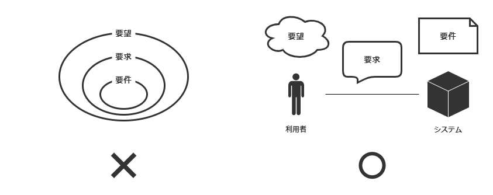

要望と要求と要件の違いは何でしょうか。

要望と要求と要件、その関係を調べるとベン図を用いた説明を見かけます。この図では要望が最も広く、その中に要求があり、さらにその中に要件があります。つまり、要件は要求の、要求は要望のサブセットというわけです。

このベン図が示す要望と要求と要件の関係は実態を正しく表現しているでしょうか？否（と私は思っています）。要望と要求と要件とは何か、それらの違いはどこにあるのかを考えてみましょう。

# 機能一覧は要件定義か

「こんな機能がほしい」、利用者の声を集めた機能一覧を一度は見たことがあるのではないでしょうか。あるシステムをリニューアルすべく打合せしているとします。現行システムにはもちろん利用者がいます。そこで利用者から声が集められます。システムは自動化が行き届いていないために運用の手間がかかると言います。

この機能一覧を元に要件が定められていきます。機能一覧には優先度を示す列が設けられており、どの機能が特に求められているかランクで分かるようになっています。さて、どの機能から実装していこうか。優先度の高い機能から実装していこう。そんな論法で打合せは進められていきます。

この議論の進め方には違和感があります。それぞれの機能をとりあげればなるほど便利そうです。そもそも便利そうだと考えたから機能一覧に挙げたはずです。機能ひとつひとつはおかしなことを言っているわけではないのです。それでもこの論法は違うと感じます。なぜでしょうか？

ユーザーの声を集めた機能一覧からピックアップして実装していくだけのやり方では、**それでどうなるのか**が見えません。機能ひとつひとつについて議論すればそれはそれで要りそうだねとなります。しかし、それらの機能を実現したときの、システムの姿が見えてきません。

そのシステムを含めた利用者を取り巻く環境がどうなるかを想像したでしょうか。それらの機能を実装していくことはきっとできます。実装するとどうなるのか。そのシステムをリリースすることはできるかもしれません。リリースするとどうなるのか。それでシステムをリニューアルしたことになるのでしょうか。

システムをリリースした先に何を見るのか、その姿を描いたもの、その欠如が違和感になっているのかなと思いました。リリースをゴールにすれば、やってやれないことはないと思います。しかし、やったところで何をしたことになるかを名言できない。それが見えてこない。というよりは、存在していないのかもしれません。

# システムの姿を定義する

システムの姿を描いていなければ、優先度の高い機能を実装していったとしてもリニューアルを完成させられたとは言えないでしょう。具体的な姿を想像することなしに目標を獲得できるとは思えません。プロジェクトとは目標を定める活動です。要件は目標です。機能一覧を"舐めていく"やり方では要件を導くことはできないでしょう。

ベン図が示す要望と要求と要件の関係は間違いで、別の形で表現されるべき関係があるのかもしれません。"要件は要求の、要求は要望のサブセット"、これは思い込みなだけで実はまったく現実に即していないのではないでしょうか。そうでなければ、優先度の高い機能を挙げていけばシステムの姿を定義できそうなものです。利用者の声をそのまま要件にするのは安易というものでしょう。

システムの姿を想像することが目標の獲得につながるなら、要件の定義とはシステムの姿の定義だと言えそうです。かと言って、利用者の声を集める方法が間違いかと言えば、そんなことはないと言うでしょう。要望や要求の整理は必要な過程であるように思えます。ならば、要件は要望や要求から飛躍するのかもしれません。

# 要件は要望や要求から飛躍する

システムには利用者がいて、システムと利用者との間には関係が存在します。
解決策としてシステムが存在するとき、課題をもった利用者が対で存在します。要件がシステムの姿で、利用者の声と切り離された定義なら、システムの姿と切り離された、利用者の声としての定義があってもよさそうです。そこで、要望と要求と要件の関係を次の絵に当てはめてみます。

たとえば、利用者の作業において工数を削減したいとする利用者の望み、これを要望とします。利用者が「受注作業の工数を削減したい」と考えているとします。工数削減したい対象の受注作業がシステムを用いるなら、暗黙にシステムに期待していることがあるかもしれません。しかし、工数削減そのものはシステムに向けた声ではありません。

利用者がシステム（の開発者）にこうあってほしいと求める声、これを要求とします。利用者は受注作業に目視を伴う転記や手計算が含まれていることに気がつきます。そしてこれらが受注作業の工数を引き上げていると考えたとします。利用者は「受注作業の一部を自動化したい」と言うでしょう。「工数削減」に対して「自動化」はシステムに向けられています。

システムおよび、そのシステムを含めた利用者を取り巻く環境をこのようにしようとする定義、これを要件とします。開発者は利用者の声をそのまま実現するとは限りません。開発者は「作業工数を削減するために一部作業を自動化したい」とする声を受けて考えます。システムがどうあるべきか。システムとの作用の中にある利用者を想像します。システムの次の姿を描くと、最後に開発者は「承認プロセスを省いた作業フロー」を提案します（！？）。

---

要件とはシステムの姿を描いた定義であると捉えると、要件の定義はもっと能動的な活動であるべきだと分かります。優先度の高い機能をただ実装していくような受け身の活動ではありません。要件は要望や要求からある意味切り離されていると考えられます。開発者は利用者の声に従うのではなく、自発的にシステムの姿を描くべきでしょう。ただし、開発者が自発的にシステムの姿を描くには利用者の声を理解する必要があります。利用者が何を望みシステムに何を求めているか。これを理解してはじめてシステムの姿を思い描くことができます。

ベン図で示す要望と要求と要件の関係を考え直してみました。利用者の望みとしての要望、システムに向けられた要求、システムの姿としての要件がある。そんな関係を考えてみました。要望と要求の発信元は利用者ですが、要件の発信元は開発者です。要望と要求は分析で、要件は設計であるとも捉えられそうです。なので、要件は要望と要求から飛躍し得ると考えられます。そして、要件を定める活動は自発的で能動的です。要件としてシステムの姿を描く。それがシステムをデザインする活動なのだと思います。
