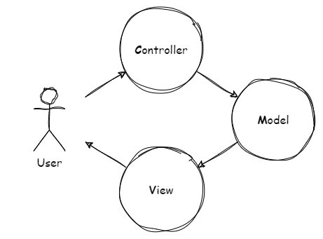
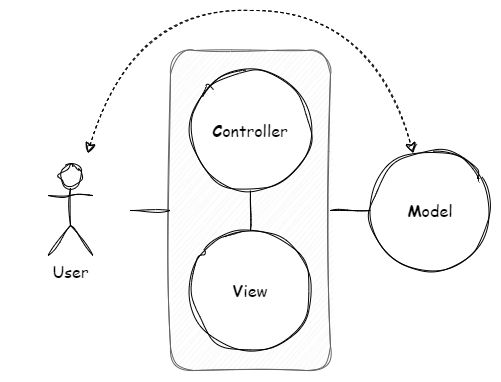
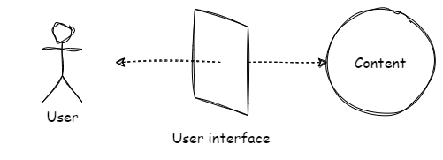
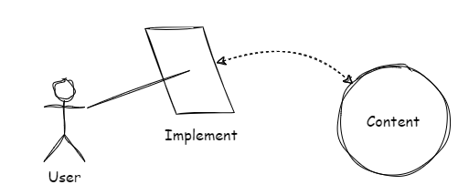

GUIを分析・設計するには、何を根拠にするのがよいでしょうか？GUIの操作対象である情報・コンテンツに焦点を当ててみましょう。インタラクティブなアプリケーションは概念的にMVCの形をしています。優れたユーザーインタフェースには元の情報・コンテンツを感じさせる何かがあります。情報・コンテンツの存在はユーザーインタフェースを決定づける重要な要素なのです。

開発対象の類似サービスを調査するにあたって、どのようにアプリケーションを捉えて観察するのがよいかを考察してみました。

# インタラクティブなアプリケーションはMVCの形をしている

インタラクティブなアプリケーションは、**ユーザーとシステムの状態との間を取り持ちます**。OSのGUIやWebサービスはユーザーと相互作用するアプリケーションです。

インタラクティブなアプリケーションはシステムの状態を表示して、ユーザーに"何か"を見せます。また、インタラクティブなアプリケーションはシステムの状態を変更して、ユーザーに"何か"を操作させます。**ユーザーが見て、操作するのは情報・コンテンツです**。

ユーザーと情報・コンテンツ、その間にある参照と操作の関係は概念的にMVCの形をしています。MVCのMはモデルです。モデルはドメインに特化したアプリケーションの中心的構造です。MVCのVはビューです。ビューはモデルからデータを要求してグラフィカルに表示するすべてのものです。MVCのCはコントローラーです。コントローラーはモデルとビュー、入力装置（キーボードやマウス、タイマー）の橋渡しをします。

MVCとは**インタラクティブなアプリケーションのユーザーインタフェースを設計するためのパラダイム**です。重要なのはMVCの概念やパラダイムそのものです。たとえば、"オブザーバー・パターンでビューとモデルを実装する"というテクニカルな面は重要ではありません。

# 情報・コンテンツの存在

**ユーザーのメンタルモデルとシステム上のデジタルモデルとのギャップをつなぎ合わせること**がMVCの本質的な目的です。ユーザーインタフェースは情報・コンテンツを直接操作する体験―イリュージョン―をユーザーに与えます。

ユーザーは、異なる場面や異なる視点で、同じ情報を見たり操作したりすることがあります。たとえば、情報を一覧して表示することもあれば、個別に表示することもあります。また、情報を表形式で表示することもあれば、グラフ形式で表示することもあります。いずれにしても**ユーザーは同じ情報・コンテンツ見ていると理解する**ことができます。ユーザーはデスクトップ上のアイコンが、エクスプローラ（Finderかもしれません）上のアイテムと「同じもの」であることを知っているわけです。

# 情報・コンテンツに方向づけられたユーザーインタフェース

ユーザーインタフェースが元の情報・コンテンツをよく反映していれば、ユーザーはその優れたユーザーインタフェースから元の情報・コンテンツを感じとることができます。

インタフェースに対する操作がインタフェースの見え方に反映されることで、ユーザーはインタフェースの先に情報・コンテンツがあると理解できます。異なる場面の異なる見え方に同じものが投影されているという同一性を認められるなら、ユーザーは同じ情報・コンテンツの違う側面を見ていると理解できます。

優れたユーザーインタフェースはユーザーに情報・コンテンツを掌握させるのです。**ユーザーはユーザーインタフェースを通じて情報・コンテンツを掌握している、そう感じさせらる**、とも言えます。

# 道具としてのユーザーインタフェース

GUIを分析・設計するには、そのGUIを方向づける元になっている情報・コンテンツに焦点を当てましょう。直接見て、触れて、観察できるのは画面の構成や機能ですが、それだけに注目しないように気をつけます。何がその画面の構成や機能をそうさせているのかを考えます。

画面の構成や機能に反映されている何か―情報・コンテンツ―を探ります。その画面の構成や機能は偶然そうなっているのではありません。ユーザーインタフェースが優れていれば、そこに情報・コンテンツに起因する一貫性を見出すことができるはずです。それこそがユーザーインタフェースの目的だからです。

**情報・コンテンツはユーザーインタフェースに先立ちます**。もちろん、画面の構成や機能、ユースケースから考え出すこともあります。画面の構成や機能、ユースケースを重要視しないわけではありません。直接見て、触るものは想像しやすいのは間違いありません。しかし、最終的には情報・コンテンツの形を画面の構成や機能、ユースケースに反映します。

情報・コンテンツによく方向づけられたユーザーインタフェースは**ユーザーにとってよい道具になり、ユーザーを対象の情報・コンテンツに近づける手段になり得ます**。一方、情報・コンテンツの形が曖昧だと、画面の構成や機能、ユースケースはいびつなパッチワークになってしまいます。

---

MVCが実現しようとするもともとの概念を知って、GUIとは、ユーザーのメンタルモデルとシステム上のデジタルモデルをつなげるものであることが分かりました。優れたユーザーインタフェースからはその先の情報・コンテンツを感じ取ることができることを述べました。また、ユーザーインタフェースを分析・設計するのに情報・コンテンツの存在が重要であることを述べました。

この考察をしてみたことで、テクニカルな面や画面の構成、機能などに目を向けてしまいがちであったことにも気がつきました。情報・コンテンツの存在に気がつくと、システムの見え方がまた少し変わってきそうです。

# 参考

- [Trygve/MVC](https://folk.universitetetioslo.no/trygver/themes/mvc/mvc-index.html)
- [artima - The DCI Architecture: A New Vision of Object-Oriented Programming](https://www.artima.com/articles/the-dci-architecture-a-new-vision-of-object-oriented-programming)

# アソシエイトリンク

- [DESIGNING CONNECTED CONTENT デジタルプロダクトの長期的な成長を支える構造化コンテンツ 単行本](https://www.amazon.co.jp/DESIGNING-CONNECTED-CONTENT-%E3%83%87%E3%82%B8%E3%82%BF%E3%83%AB%E3%83%97%E3%83%AD%E3%83%80%E3%82%AF%E3%83%88%E3%81%AE%E9%95%B7%E6%9C%9F%E7%9A%84%E3%81%AA%E6%88%90%E9%95%B7%E3%82%92%E6%94%AF%E3%81%88%E3%82%8B%E6%A7%8B%E9%80%A0%E5%8C%96%E3%82%B3%E3%83%B3%E3%83%86%E3%83%B3%E3%83%84-%E3%83%9E%E3%82%A4%E3%82%AF%E3%83%BB%E3%82%A2%E3%82%B6%E3%83%BC%E3%83%88%E3%83%B3/dp/4862465196?__mk_ja_JP=%E3%82%AB%E3%82%BF%E3%82%AB%E3%83%8A&crid=3Q59QKNG6CWP2&dib=eyJ2IjoiMSJ9.LxcouHJOIBFEr8tFHwUWLw.-Z3tkRHYoPjPhsEBqwMzOR_pWSbrfxN5hVAaPFB74ME&dib_tag=se&keywords=4862465196&qid=1705678031&sprefix=4862465196%2Caps%2C194&sr=8-1&linkCode=ll1&tag=fukuchiharuki-22&linkId=68e61dee47772621061c268b508e1f21&language=ja_JP&ref_=as_li_ss_tl)
- [オブジェクト指向UIデザイン──使いやすいソフトウェアの原理 (WEB+DB PRESS plusシリーズ) 単行本（ソフトカバー）](https://www.amazon.co.jp/%E3%82%AA%E3%83%96%E3%82%B8%E3%82%A7%E3%82%AF%E3%83%88%E6%8C%87%E5%90%91UI%E3%83%87%E3%82%B6%E3%82%A4%E3%83%B3%E2%94%80%E2%94%80%E4%BD%BF%E3%81%84%E3%82%84%E3%81%99%E3%81%84%E3%82%BD%E3%83%95%E3%83%88%E3%82%A6%E3%82%A7%E3%82%A2%E3%81%AE%E5%8E%9F%E7%90%86-WEB-DB-PRESS-plus%E3%82%B7%E3%83%AA%E3%83%BC%E3%82%BA/dp/4297113511?__mk_ja_JP=%E3%82%AB%E3%82%BF%E3%82%AB%E3%83%8A&crid=1WHCPO130HSLM&dib=eyJ2IjoiMSJ9.iEc8uvmhbWFp7TmtlFZ4tQ.t3RolxLH0YN_A7JdTaY6ZNNTE5dbJhr3F0HR9EOSseA&dib_tag=se&keywords=4297113511&qid=1705677857&sprefix=4297113511%2Caps%2C289&sr=8-1&linkCode=ll1&tag=fukuchiharuki-22&linkId=5675972b2def90b88ab6eaa8884fdcff&language=ja_JP&ref_=as_li_ss_tl)
