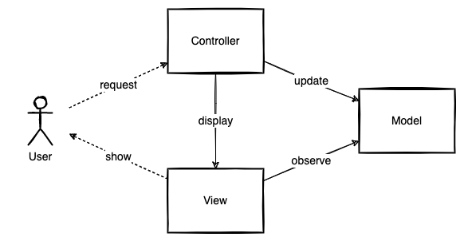
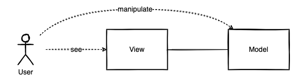
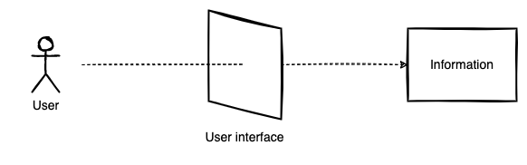
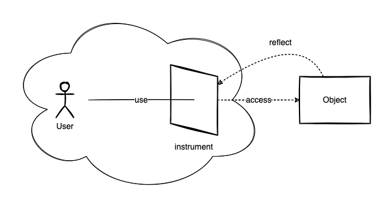

GUIを分析するには、または設計するにしても、そのGUIを方向づける元になっている情報・コンテンツに焦点を当てます。インタラクティブなアプリケーションは概念的にMVCの形をしています。優れたユーザーインタフェースからは元の情報・コンテンツを感じとることができます。情報・コンテンツの存在はユーザーインタフェースを設計するときにも重要です。

# インタラクティブなアプリケーションはMVCの形をしている

ユーザーと相互作用するアプリケーションは概念的にMVCの形をしています。OSのGUIやWebサービスはユーザーと相互作用するアプリケーションです。インタラクティブなアプリケーションはユーザーと、システムの状態との間を取り持ちます。インタラクティブなアプリケーションはシステムの状態を表示して、ユーザーに何かを見せることができます。また、インタラクティブなアプリケーションはシステムの状態を変更して、ユーザーに何かを操作させることができます。ユーザーが見て操作するのは情報・コンテンツです。ユーザーと情報・コンテンツ、その間にある参照と操作の関係は概念的にMVCの形をしているのです。

MVCとはインタラクティブなアプリケーションのユーザーインタフェースを設計するためのパラダイムです。MVCのMはモデルです。モデルはドメインに特化したアプリケーションの中心的構造です。MVCのVはビューです。ビューはモデルからデータを要求してグラフィカルに表示するすべてのものです。MVCのCはコントローラーです。コントローラーはモデルとビュー、入力装置（キーボードやマウス、タイマー）の橋渡しをします。MVCは概念的なパラダイムなので、実装にはいくつもの派生があります。しかし、たとえば、observerパターンでビューとモデルを実装するというテクニカルな面は重要ではありません。重要なのはMVCの概念やパラダイムそのものです。

ユーザーのメンタルモデルとシステム上のデジタルモデルとのギャップをつなぎ合わせることがMVCの本質的な目的です。ユーザーインタフェースは情報・コンテンツを直接操作する体験―イリュージョン―をユーザーに与えます。ユーザーは、異なる場面や異なる視点で、同じ情報を見たり操作したりすることがあります。たとえば、情報を一覧して表示することもあれば、個別に表示することもあります。また、情報を表形式で表示することもあれば、グラフ形式で表示することもあります。いずれにしてもユーザーは同じ情報・コンテンツ見ていると理解できます。ユーザーはデスクトップ上のアイコンが、エクスプローラ（Finderかもしれません）上のアイテムと「同じもの」であることを知っているわけです。

# 情報・コンテンツに方向づけられたユーザーインタフェース

ユーザーは優れたユーザーインタフェースから元の情報・コンテンツを感じとることができます。優れたユーザーインタフェースは元の情報・コンテンツをよく反映しています。インタフェースに対する操作がインタフェースの見え方に反映されることで、ユーザーはインタフェースの先に情報・コンテンツがあると理解できます。異なる場面の異なる見え方に同じものが投影されているという同一性を認められるなら、ユーザーは同じ情報・コンテンツの違う側面を見ていると理解できます。優れたユーザーインタフェースはユーザーに情報・コンテンツを掌握させるのです。ユーザーはユーザーインタフェースを通じて情報・コンテンツを掌握している、そう感じさせられている、と言えるかもしれません。

GUIを分析するには、そのGUIを方向づける元になっている情報・コンテンツに焦点を当てます。直接見て、触れて、観察できるのは画面の構成や機能です。しかし、画面の構成や機能だけに注目しないように気をつけます。何がその画面の構成や機能をそうさせているのかを考えます。その画面の構成や機能は偶然そうなっているのではありません。画面の構成や機能に反映されている何か―情報・コンテンツ―を探ります。ユーザーインタフェースが優れていれば、そこに情報・コンテンツに起因する一貫性を見出すことができるはずです。それこそがユーザーインタフェースの目的だからです。

情報・コンテンツはユーザーインタフェースに先立ちます。情報・コンテンツの存在は、GUIを分析するときだけでなく、GUIを設計するときにも同じように重要です。画面の構成や機能、ユースケースを重要視しないわけではありません。もちろん、画面の構成や機能、ユースケースから考え出すこともあります。直接見て、触るものは想像しやすいのは間違いありません。しかし、最終的には情報・コンテンツの形を画面の構成や機能、ユースケースに反映させていきます。情報・コンテンツの形が曖昧だと、画面の構成や機能、ユースケースはいびつなパッチワークになってしまいます。一方、情報・コンテンツによく方向づけられたユーザーインタフェースはユーザーにとってよい道具になり、ユーザーを対象の情報・コンテンツに近づける手段になり得ます。

---

開発対象の類似サービスを調査するにあたって、どのようにアプリケーションを捉えて観察するのがよいかを考察してみました。MVCが実現しようとするもともとの概念を知って、GUIとは、ユーザーのメンタルモデルとシステム上のデジタルモデルをつなげるものであることが分かりました。優れたユーザーインタフェースからはその先の情報・コンテンツを感じ取ることができることを述べました。また、ユーザーインタフェースを設計するときにも情報・コンテンツの存在が重要であることを述べました。

考察してみたことで、テクニカルな面や画面の構成、機能などに目を向けてしまいがちであったことにも気がつきました。情報・コンテンツの存在に気がつくと、システムの見え方がまた少し変わってきそうです。

# 参考

- [Trygve/MVC](https://folk.universitetetioslo.no/trygver/themes/mvc/mvc-index.html)
- [artima - The DCI Architecture: A New Vision of Object-Oriented Programming](https://www.artima.com/articles/the-dci-architecture-a-new-vision-of-object-oriented-programming)

<iframe style="width:120px;height:240px;" marginwidth="0" marginheight="0" scrolling="no" frameborder="0" src="//rcm-fe.amazon-adsystem.com/e/cm?lt1=_blank&bc1=000000&IS2=1&bg1=FFFFFF&fc1=000000&lc1=0000FF&t=fukuchiharuki-22&language=ja_JP&o=9&p=8&l=as4&m=amazon&f=ifr&ref=as_ss_li_til&asins=4862465196&linkId=ec59cd1638f9d88a1df9e16db0bbd4c1"></iframe>

<iframe style="width:120px;height:240px;" marginwidth="0" marginheight="0" scrolling="no" frameborder="0" src="//rcm-fe.amazon-adsystem.com/e/cm?lt1=_blank&bc1=000000&IS2=1&bg1=FFFFFF&fc1=000000&lc1=0000FF&t=fukuchiharuki-22&language=ja_JP&o=9&p=8&l=as4&m=amazon&f=ifr&ref=as_ss_li_til&asins=4297113511&linkId=e3e97f2405e04281eb551cd738cde8b9"></iframe>
