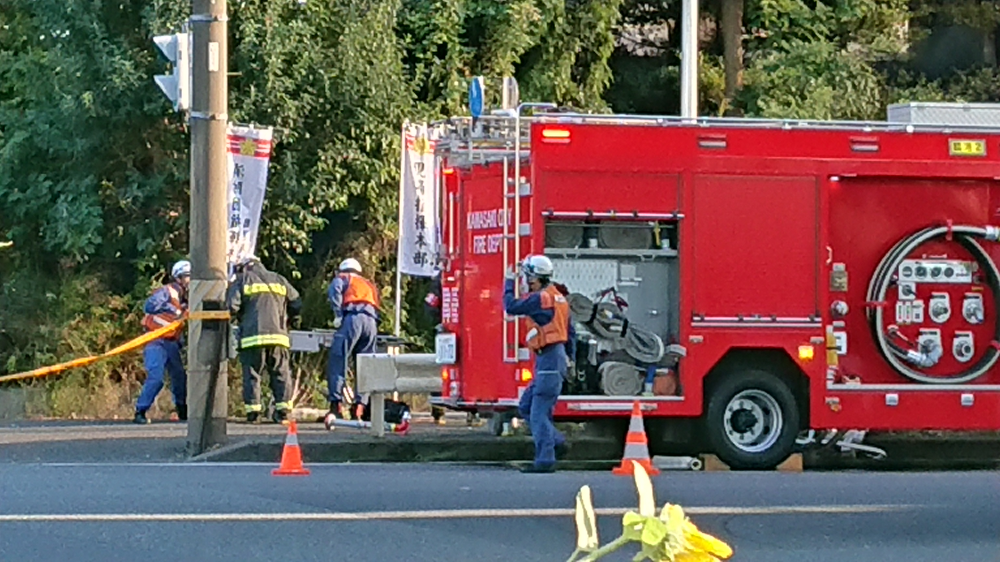

先日散歩をしていたら近所で火事の現場を見かけました。仕事がリモートワークになってからもう３年くらいになります。以前は通勤がそれなりの運動になっていました。家から駅までの徒歩も往復になればそれなりの距離と時間になります。からだを動かすことが減った分、週末は散歩をするようにしています。そんなある日のことでした。

火事の現場を見て、消防士さんらが仕事する姿に興味をひかれました。現場にはたくさんの消防車が集まってきていました。さらに救急車も。これだけ多くの人が集まってひとつ事態の収拾を図るのだなと少し驚きました。

**現場にはいろんなユニフォームの人がいました。**フードにヘルメットをかぶったいわゆる消防士さんという姿をした方。黒いジャケットの方もいれば緑のジャケットの方もいます。また黒やオレンジのベストを着ている方。救急隊と思われる上下水色姿の方。高架下の火事だったのでJRの職員さんも来ていました。ただ人が多いのではなく、いろんな役割をもった人たちが集まっているのだなと思いました。

**現場ではまず「現場指揮本部」を置いていました。**消防車が現場近くに到着すると、まずのぼりが立てられました。のぼりには「現場指揮本部」と書かれています。ずいぶんと余裕なんだな？とも思いましたが、すぐに考えを改めました。これだけ多くの人が集まって、混乱することなく消防活動をしていっているのです。きっちり事態の収拾につなげるために、多様な活動を統合する機能が必要なのは当然でしょう。目立つのぼりは、指揮のもと動いていることを示す意味もあるのだと思います。

---

**プロジェクトの遂行、現場での問題解決、その構えの見本を見たような気がしました。**実際に、消防車の列には「指揮隊車」があり、「指揮本部」を設置する「指揮隊」が乗り込んでいるそうです。情報収集に作戦立案、伝令に通信。指揮隊の中にも役割があります。消防部隊を指揮して人命救出するとともに、隊員の安全管理と二次災害の防止を図る。それが指揮隊の任務なのだそうです。組織ではセクションごとに人を集めて仕事をすることがあります。プロジェクトではそれが普通の形でしょう。多様なメンバーを寄せ集めたチームでどのようにプロジェクトを推進するか。消防活動の中にそのヒントがありました。
